```mermaid
graph TD
    EQ["Heat Exchanger<br/>HeatExchanger"]
    style EQ fill:#ff9999,stroke:#333,stroke-width:3px
    DEV0["A Chw Diff Press Sensor<br/>DifferentialSensor"]
    style DEV0 fill:#99ccff,stroke:#333,stroke-width:2px
    EQ -->|contains| DEV0
    DEV0_PROP0["A Chw Diff Press<br/>QuantifiableObservableProperty"]
    style DEV0_PROP0 fill:#ffff99,stroke:#333,stroke-width:1px
    DEV0 -->|observes| DEV0_PROP0
    DEV0_CP1["A Out<br/>InletConnectionPoint"]
    style DEV0_CP1 fill:#99ff99,stroke:#333,stroke-width:1px
    DEV0 -->|hasObservationLocationLow| DEV0_CP1
    DEV0_CP2["A In<br/>OutletConnectionPoint"]
    style DEV0_CP2 fill:#99ff99,stroke:#333,stroke-width:1px
    DEV0 -->|hasObservationLocationHigh| DEV0_CP2
    DEV1["Chw Flow Sensor<br/>Sensor"]
    style DEV1 fill:#99ccff,stroke:#333,stroke-width:2px
    EQ -->|contains| DEV1
    DEV1_CP0["B Out<br/>InletConnectionPoint"]
    style DEV1_CP0 fill:#99ff99,stroke:#333,stroke-width:1px
    DEV1 -->|hasObservationLocation| DEV1_CP0
    DEV1_PROP1["Chw Flow<br/>QuantifiableObservableProperty"]
    style DEV1_PROP1 fill:#ffff99,stroke:#333,stroke-width:1px
    DEV1 -->|observes| DEV1_PROP1
    DEV2["B Chw Diff Press Sensor<br/>DifferentialSensor"]
    style DEV2 fill:#99ccff,stroke:#333,stroke-width:2px
    EQ -->|contains| DEV2
    DEV2_PROP0["B Chw Diff Press<br/>QuantifiableObservableProperty"]
    style DEV2_PROP0 fill:#ffff99,stroke:#333,stroke-width:1px
    DEV2 -->|observes| DEV2_PROP0
    DEV2_CP1["B Out<br/>InletConnectionPoint"]
    style DEV2_CP1 fill:#99ff99,stroke:#333,stroke-width:1px
    DEV2 -->|hasObservationLocationLow| DEV2_CP1
    DEV2_CP2["B In<br/>OutletConnectionPoint"]
    style DEV2_CP2 fill:#99ff99,stroke:#333,stroke-width:1px
    DEV2 -->|hasObservationLocationHigh| DEV2_CP2
    PROP0["Chw Return Temperature<br/>QuantifiableObservableProperty"]
    style PROP0 fill:#ffff99,stroke:#333,stroke-width:1px
    EQ -->|hasProperty| PROP0
    PROP1["Chw Supply Temperature<br/>QuantifiableObservableProperty"]
    style PROP1 fill:#ffff99,stroke:#333,stroke-width:1px
    EQ -->|hasProperty| PROP1
    PROP2["A Chw Diff Press<br/>QuantifiableObservableProperty"]
    style PROP2 fill:#ffff99,stroke:#333,stroke-width:1px
    EQ -->|hasProperty| PROP2
    PROP3["Chw Flow<br/>QuantifiableObservableProperty"]
    style PROP3 fill:#ffff99,stroke:#333,stroke-width:1px
    EQ -->|hasProperty| PROP3
    PROP4["Quantifiable Observable Proper<br/>QuantifiableObservableProperty"]
    style PROP4 fill:#ffff99,stroke:#333,stroke-width:1px
    EQ -->|hasProperty| PROP4
    PROP4_REF0["B A Cnet External Reference<br/>BACnetExternalReference"]
    style PROP4_REF0 fill:#ffccff,stroke:#333,stroke-width:1px
    PROP4 -->|hasExternalReference| PROP4_REF0
    PROP5["B Chw Diff Press<br/>QuantifiableObservableProperty"]
    style PROP5 fill:#ffff99,stroke:#333,stroke-width:1px
    EQ -->|hasProperty| PROP5
    CP0["B In<br/>OutletConnectionPoint"]
    style CP0 fill:#99ff99,stroke:#333,stroke-width:1px
    EQ -->|hasConnectionPoint| CP0
    CP1["A In<br/>OutletConnectionPoint"]
    style CP1 fill:#99ff99,stroke:#333,stroke-width:1px
    EQ -->|hasConnectionPoint| CP1
    CP2["A Out<br/>InletConnectionPoint"]
    style CP2 fill:#99ff99,stroke:#333,stroke-width:1px
    EQ -->|hasConnectionPoint| CP2
    CP3["B Out<br/>InletConnectionPoint"]
    style CP3 fill:#99ff99,stroke:#333,stroke-width:1px
    EQ -->|hasConnectionPoint| CP3
```

```mermaid
graph TD
    EQ["Hot Water System<br/>System"]
    style EQ fill:#ff9999,stroke:#333,stroke-width:3px
    DEV0["Lead Hw Booster Pump<br/>Pump"]
    style DEV0 fill:#99ccff,stroke:#333,stroke-width:2px
    EQ -->|contains| DEV0
    DEV0_PROP0["Lead Hw Booster Pump Vfd Flt<br/>EnumeratedObservableProperty"]
    style DEV0_PROP0 fill:#ffff99,stroke:#333,stroke-width:1px
    DEV0 -->|hasProperty| DEV0_PROP0
    DEV0_PROP1["Lead Hw Booster Pump Vfd Energ<br/>QuantifiableObservableProperty"]
    style DEV0_PROP1 fill:#ffff99,stroke:#333,stroke-width:1px
    DEV0 -->|hasProperty| DEV0_PROP1
    DEV0_PROP2["Fan speed as percentage of max<br/>QuantifiableActuatableProperty"]
    style DEV0_PROP2 fill:#ffff99,stroke:#333,stroke-width:1px
    DEV0 -->|hasProperty| DEV0_PROP2
    DEV0_PROP3["Lead Hw Booster Pump Vfd Cur<br/>QuantifiableObservableProperty"]
    style DEV0_PROP3 fill:#ffff99,stroke:#333,stroke-width:1px
    DEV0 -->|hasProperty| DEV0_PROP3
    DEV0_PROP4["Lead Hw Booster Pump Onoff Sts<br/>EnumeratedObservableProperty"]
    style DEV0_PROP4 fill:#ffff99,stroke:#333,stroke-width:1px
    DEV0 -->|hasProperty| DEV0_PROP4
    DEV0_PROP5["Fan speed feedback as percenta<br/>QuantifiableObservableProperty"]
    style DEV0_PROP5 fill:#ffff99,stroke:#333,stroke-width:1px
    DEV0 -->|hasProperty| DEV0_PROP5
    DEV0_PROP6["Lead Hw Booster Pump Vfd Pwr<br/>QuantifiableObservableProperty"]
    style DEV0_PROP6 fill:#ffff99,stroke:#333,stroke-width:1px
    DEV0 -->|hasProperty| DEV0_PROP6
    DEV0_PROP7["Lead Hw Booster Pump Vfd Volt<br/>QuantifiableObservableProperty"]
    style DEV0_PROP7 fill:#ffff99,stroke:#333,stroke-width:1px
    DEV0 -->|hasProperty| DEV0_PROP7
    DEV0_PROP8["Lead Hw Booster Pump Vfd Frq<br/>QuantifiableObservableProperty"]
    style DEV0_PROP8 fill:#ffff99,stroke:#333,stroke-width:1px
    DEV0 -->|hasProperty| DEV0_PROP8
    DEV0_PROP9["Lead Hw Booster Pump Onoff Cmd<br/>EnumeratedActuatableProperty"]
    style DEV0_PROP9 fill:#ffff99,stroke:#333,stroke-width:1px
    DEV0 -->|hasProperty| DEV0_PROP9
    DEV0_CP10["Lead Hw Booster Pump In<br/>InletConnectionPoint"]
    style DEV0_CP10 fill:#99ff99,stroke:#333,stroke-width:1px
    DEV0 -->|hasConnectionPoint| DEV0_CP10
    DEV0_CP11["Lead Hw Booster Pump Out<br/>OutletConnectionPoint"]
    style DEV0_CP11 fill:#99ff99,stroke:#333,stroke-width:1px
    DEV0 -->|hasConnectionPoint| DEV0_CP11
    DEV1["Bypass Valve<br/>Valve"]
    style DEV1 fill:#99ccff,stroke:#333,stroke-width:2px
    EQ -->|contains| DEV1
    DEV1_CP0["Bypass Valve Out<br/>OutletConnectionPoint"]
    style DEV1_CP0 fill:#99ff99,stroke:#333,stroke-width:1px
    DEV1 -->|hasConnectionPoint| DEV1_CP0
    DEV1_CP1["Bypass Valve In<br/>InletConnectionPoint"]
    style DEV1_CP1 fill:#99ff99,stroke:#333,stroke-width:1px
    DEV1 -->|hasConnectionPoint| DEV1_CP1
    DEV1_PROP2["Bypass Valve Command<br/>EnumeratedActuatableProperty"]
    style DEV1_PROP2 fill:#ffff99,stroke:#333,stroke-width:1px
    DEV1 -->|hasProperty| DEV1_PROP2
    DEV1_PROP3["Bypass Valve Feedback<br/>EnumeratedObservableProperty"]
    style DEV1_PROP3 fill:#ffff99,stroke:#333,stroke-width:1px
    DEV1 -->|hasProperty| DEV1_PROP3
    DEV2["Lead Hw Pump<br/>Pump"]
    style DEV2 fill:#99ccff,stroke:#333,stroke-width:2px
    EQ -->|contains| DEV2
    DEV2_PROP0["Fan speed as percentage of max<br/>QuantifiableActuatableProperty"]
    style DEV2_PROP0 fill:#ffff99,stroke:#333,stroke-width:1px
    DEV2 -->|hasProperty| DEV2_PROP0
    DEV2_PROP1["Lead Hw Pump Onoff Sts<br/>EnumeratedObservableProperty"]
    style DEV2_PROP1 fill:#ffff99,stroke:#333,stroke-width:1px
    DEV2 -->|hasProperty| DEV2_PROP1
    DEV2_CP2["Lead Hw Pump Out<br/>OutletConnectionPoint"]
    style DEV2_CP2 fill:#99ff99,stroke:#333,stroke-width:1px
    DEV2 -->|hasConnectionPoint| DEV2_CP2
    DEV2_PROP3["Lead Hw Pump Vfd Pwr<br/>QuantifiableObservableProperty"]
    style DEV2_PROP3 fill:#ffff99,stroke:#333,stroke-width:1px
    DEV2 -->|hasProperty| DEV2_PROP3
    DEV2_PROP4["Lead Hw Pump Vfd Frq<br/>QuantifiableObservableProperty"]
    style DEV2_PROP4 fill:#ffff99,stroke:#333,stroke-width:1px
    DEV2 -->|hasProperty| DEV2_PROP4
    DEV2_PROP5["Lead Hw Pump Onoff Cmd<br/>EnumeratedActuatableProperty"]
    style DEV2_PROP5 fill:#ffff99,stroke:#333,stroke-width:1px
    DEV2 -->|hasProperty| DEV2_PROP5
    DEV2_PROP6["Lead Hw Pump Vfd Energy<br/>QuantifiableObservableProperty"]
    style DEV2_PROP6 fill:#ffff99,stroke:#333,stroke-width:1px
    DEV2 -->|hasProperty| DEV2_PROP6
    DEV2_PROP7["Lead Hw Pump Vfd Flt<br/>EnumeratedObservableProperty"]
    style DEV2_PROP7 fill:#ffff99,stroke:#333,stroke-width:1px
    DEV2 -->|hasProperty| DEV2_PROP7
    DEV2_CP8["Lead Hw Pump In<br/>InletConnectionPoint"]
    style DEV2_CP8 fill:#99ff99,stroke:#333,stroke-width:1px
    DEV2 -->|hasConnectionPoint| DEV2_CP8
    DEV2_PROP9["Fan speed feedback as percenta<br/>QuantifiableObservableProperty"]
    style DEV2_PROP9 fill:#ffff99,stroke:#333,stroke-width:1px
    DEV2 -->|hasProperty| DEV2_PROP9
    DEV2_PROP10["Lead Hw Pump Vfd Cur<br/>QuantifiableObservableProperty"]
    style DEV2_PROP10 fill:#ffff99,stroke:#333,stroke-width:1px
    DEV2 -->|hasProperty| DEV2_PROP10
    DEV2_PROP11["Lead Hw Pump Vfd Volt<br/>QuantifiableObservableProperty"]
    style DEV2_PROP11 fill:#ffff99,stroke:#333,stroke-width:1px
    DEV2 -->|hasProperty| DEV2_PROP11
    DEV3["Standby Hw Booster Pump<br/>Pump"]
    style DEV3 fill:#99ccff,stroke:#333,stroke-width:2px
    EQ -->|contains| DEV3
    DEV3_CP0["Standby Hw Booster Pump In<br/>InletConnectionPoint"]
    style DEV3_CP0 fill:#99ff99,stroke:#333,stroke-width:1px
    DEV3 -->|hasConnectionPoint| DEV3_CP0
    DEV3_PROP1["Standby Hw Booster Pump Vfd Pw<br/>QuantifiableObservableProperty"]
    style DEV3_PROP1 fill:#ffff99,stroke:#333,stroke-width:1px
    DEV3 -->|hasProperty| DEV3_PROP1
    DEV3_CP2["Standby Hw Booster Pump Out<br/>OutletConnectionPoint"]
    style DEV3_CP2 fill:#99ff99,stroke:#333,stroke-width:1px
    DEV3 -->|hasConnectionPoint| DEV3_CP2
    DEV3_PROP3["Fan speed as percentage of max<br/>QuantifiableActuatableProperty"]
    style DEV3_PROP3 fill:#ffff99,stroke:#333,stroke-width:1px
    DEV3 -->|hasProperty| DEV3_PROP3
    DEV3_PROP4["Standby Hw Booster Pump Vfd Fl<br/>EnumeratedObservableProperty"]
    style DEV3_PROP4 fill:#ffff99,stroke:#333,stroke-width:1px
    DEV3 -->|hasProperty| DEV3_PROP4
    DEV3_PROP5["Standby Hw Booster Pump Vfd Fr<br/>QuantifiableObservableProperty"]
    style DEV3_PROP5 fill:#ffff99,stroke:#333,stroke-width:1px
    DEV3 -->|hasProperty| DEV3_PROP5
    DEV3_PROP6["Fan speed feedback as percenta<br/>QuantifiableObservableProperty"]
    style DEV3_PROP6 fill:#ffff99,stroke:#333,stroke-width:1px
    DEV3 -->|hasProperty| DEV3_PROP6
    DEV3_PROP7["Standby Hw Booster Pump Vfd En<br/>QuantifiableObservableProperty"]
    style DEV3_PROP7 fill:#ffff99,stroke:#333,stroke-width:1px
    DEV3 -->|hasProperty| DEV3_PROP7
    DEV3_PROP8["Standby Hw Booster Pump Vfd Vo<br/>QuantifiableObservableProperty"]
    style DEV3_PROP8 fill:#ffff99,stroke:#333,stroke-width:1px
    DEV3 -->|hasProperty| DEV3_PROP8
    DEV3_PROP9["Standby Hw Booster Pump Vfd Cu<br/>QuantifiableObservableProperty"]
    style DEV3_PROP9 fill:#ffff99,stroke:#333,stroke-width:1px
    DEV3 -->|hasProperty| DEV3_PROP9
    DEV3_PROP10["Standby Hw Booster Pump Onoff <br/>EnumeratedObservableProperty"]
    style DEV3_PROP10 fill:#ffff99,stroke:#333,stroke-width:1px
    DEV3 -->|hasProperty| DEV3_PROP10
    DEV3_PROP11["Standby Hw Booster Pump Onoff <br/>EnumeratedActuatableProperty"]
    style DEV3_PROP11 fill:#ffff99,stroke:#333,stroke-width:1px
    DEV3 -->|hasProperty| DEV3_PROP11
    DEV4["Standby Hw Pump<br/>Pump"]
    style DEV4 fill:#99ccff,stroke:#333,stroke-width:2px
    EQ -->|contains| DEV4
    DEV4_PROP0["Standby Hw Pump Vfd Frq<br/>QuantifiableObservableProperty"]
    style DEV4_PROP0 fill:#ffff99,stroke:#333,stroke-width:1px
    DEV4 -->|hasProperty| DEV4_PROP0
    DEV4_PROP1["Standby Hw Pump Vfd Cur<br/>QuantifiableObservableProperty"]
    style DEV4_PROP1 fill:#ffff99,stroke:#333,stroke-width:1px
    DEV4 -->|hasProperty| DEV4_PROP1
    DEV4_PROP2["Fan speed as percentage of max<br/>QuantifiableActuatableProperty"]
    style DEV4_PROP2 fill:#ffff99,stroke:#333,stroke-width:1px
    DEV4 -->|hasProperty| DEV4_PROP2
    DEV4_PROP3["Standby Hw Pump Onoff Cmd<br/>EnumeratedActuatableProperty"]
    style DEV4_PROP3 fill:#ffff99,stroke:#333,stroke-width:1px
    DEV4 -->|hasProperty| DEV4_PROP3
    DEV4_PROP4["Standby Hw Pump Onoff Sts<br/>EnumeratedObservableProperty"]
    style DEV4_PROP4 fill:#ffff99,stroke:#333,stroke-width:1px
    DEV4 -->|hasProperty| DEV4_PROP4
    DEV4_PROP5["Standby Hw Pump Vfd Pwr<br/>QuantifiableObservableProperty"]
    style DEV4_PROP5 fill:#ffff99,stroke:#333,stroke-width:1px
    DEV4 -->|hasProperty| DEV4_PROP5
    DEV4_PROP6["Fan speed feedback as percenta<br/>QuantifiableObservableProperty"]
    style DEV4_PROP6 fill:#ffff99,stroke:#333,stroke-width:1px
    DEV4 -->|hasProperty| DEV4_PROP6
    DEV4_PROP7["Standby Hw Pump Vfd Energy<br/>QuantifiableObservableProperty"]
    style DEV4_PROP7 fill:#ffff99,stroke:#333,stroke-width:1px
    DEV4 -->|hasProperty| DEV4_PROP7
    DEV4_PROP8["Standby Hw Pump Vfd Flt<br/>EnumeratedObservableProperty"]
    style DEV4_PROP8 fill:#ffff99,stroke:#333,stroke-width:1px
    DEV4 -->|hasProperty| DEV4_PROP8
    DEV4_CP9["Standby Hw Pump In<br/>InletConnectionPoint"]
    style DEV4_CP9 fill:#99ff99,stroke:#333,stroke-width:1px
    DEV4 -->|hasConnectionPoint| DEV4_CP9
    DEV4_PROP10["Standby Hw Pump Vfd Volt<br/>QuantifiableObservableProperty"]
    style DEV4_PROP10 fill:#ffff99,stroke:#333,stroke-width:1px
    DEV4 -->|hasProperty| DEV4_PROP10
    DEV4_CP11["Standby Hw Pump Out<br/>OutletConnectionPoint"]
    style DEV4_CP11 fill:#99ff99,stroke:#333,stroke-width:1px
    DEV4 -->|hasConnectionPoint| DEV4_CP11
```

```mermaid
graph TD
    EQ["Dwh Dw Hx<br/>HeatExchanger"]
    style EQ fill:#ff9999,stroke:#333,stroke-width:3px
    DEV0["Dwh Dw Hx Chw Flow Sensor<br/>Sensor"]
    style DEV0 fill:#99ccff,stroke:#333,stroke-width:2px
    EQ -->|contains| DEV0
    DEV0_PROP0["Dwh Dw Hx Chw Flow<br/>QuantifiableObservableProperty"]
    style DEV0_PROP0 fill:#ffff99,stroke:#333,stroke-width:1px
    DEV0 -->|observes| DEV0_PROP0
    DEV0_CP1["Dwh Dw Hx B Out<br/>InletConnectionPoint"]
    style DEV0_CP1 fill:#99ff99,stroke:#333,stroke-width:1px
    DEV0 -->|hasObservationLocation| DEV0_CP1
    DEV1["Dwh Dw Hx A Chw Diff Press Sensor<br/>DifferentialSensor"]
    style DEV1 fill:#99ccff,stroke:#333,stroke-width:2px
    EQ -->|contains| DEV1
    DEV1_CP0["Dwh Dw Hx A Out<br/>InletConnectionPoint"]
    style DEV1_CP0 fill:#99ff99,stroke:#333,stroke-width:1px
    DEV1 -->|hasObservationLocationLow| DEV1_CP0
    DEV1_PROP1["Dwh Dw Hx A Chw Diff Press<br/>QuantifiableObservableProperty"]
    style DEV1_PROP1 fill:#ffff99,stroke:#333,stroke-width:1px
    DEV1 -->|observes| DEV1_PROP1
    DEV1_CP2["Dwh Dw Hx A In<br/>OutletConnectionPoint"]
    style DEV1_CP2 fill:#99ff99,stroke:#333,stroke-width:1px
    DEV1 -->|hasObservationLocationHigh| DEV1_CP2
    DEV2["Dwh Dw Hx B Chw Diff Press Sensor<br/>DifferentialSensor"]
    style DEV2 fill:#99ccff,stroke:#333,stroke-width:2px
    EQ -->|contains| DEV2
    DEV2_PROP0["Dwh Dw Hx B Chw Diff Press<br/>QuantifiableObservableProperty"]
    style DEV2_PROP0 fill:#ffff99,stroke:#333,stroke-width:1px
    DEV2 -->|observes| DEV2_PROP0
    DEV2_CP1["Dwh Dw Hx B Out<br/>InletConnectionPoint"]
    style DEV2_CP1 fill:#99ff99,stroke:#333,stroke-width:1px
    DEV2 -->|hasObservationLocationLow| DEV2_CP1
    DEV2_CP2["Dwh Dw Hx B In<br/>OutletConnectionPoint"]
    style DEV2_CP2 fill:#99ff99,stroke:#333,stroke-width:1px
    DEV2 -->|hasObservationLocationHigh| DEV2_CP2
    PROP0["Dwh Dw Hx Chw Return Temperatu<br/>QuantifiableObservableProperty"]
    style PROP0 fill:#ffff99,stroke:#333,stroke-width:1px
    EQ -->|hasProperty| PROP0
    PROP1["Dwh Dw Hx A Chw Diff Press<br/>QuantifiableObservableProperty"]
    style PROP1 fill:#ffff99,stroke:#333,stroke-width:1px
    EQ -->|hasProperty| PROP1
    PROP2["Dwh Dw Hx Chw Supply Temperatu<br/>QuantifiableObservableProperty"]
    style PROP2 fill:#ffff99,stroke:#333,stroke-width:1px
    EQ -->|hasProperty| PROP2
    PROP3["Dwh Dw Hx Chw Flow<br/>QuantifiableObservableProperty"]
    style PROP3 fill:#ffff99,stroke:#333,stroke-width:1px
    EQ -->|hasProperty| PROP3
    PROP4["Dwh Dw Hx B Chw Diff Press<br/>QuantifiableObservableProperty"]
    style PROP4 fill:#ffff99,stroke:#333,stroke-width:1px
    EQ -->|hasProperty| PROP4
    CP0["Dwh Dw Hx A In<br/>OutletConnectionPoint"]
    style CP0 fill:#99ff99,stroke:#333,stroke-width:1px
    EQ -->|hasConnectionPoint| CP0
    CP1["Dwh Dw Hx A Out<br/>InletConnectionPoint"]
    style CP1 fill:#99ff99,stroke:#333,stroke-width:1px
    EQ -->|hasConnectionPoint| CP1
    CP2["Dwh Dw Hx B Out<br/>InletConnectionPoint"]
    style CP2 fill:#99ff99,stroke:#333,stroke-width:1px
    EQ -->|hasConnectionPoint| CP2
    CP3["Dwh Dw Hx B In<br/>OutletConnectionPoint"]
    style CP3 fill:#99ff99,stroke:#333,stroke-width:1px
    EQ -->|hasConnectionPoint| CP3
```

```mermaid
graph TD
    EQ["domestic water heater<br/>Equipment"]
    style EQ fill:#ff9999,stroke:#333,stroke-width:3px
    DEV0["Dwh Dw Hwp<br/>Pump"]
    style DEV0 fill:#99ccff,stroke:#333,stroke-width:2px
    EQ -->|contains| DEV0
    DEV0_PROP0["Dwh Dw Hwp Vfd Flt<br/>EnumeratedObservableProperty"]
    style DEV0_PROP0 fill:#ffff99,stroke:#333,stroke-width:1px
    DEV0 -->|hasProperty| DEV0_PROP0
    DEV0_PROP1["Dwh Dw Hwp Vfd Cur<br/>QuantifiableObservableProperty"]
    style DEV0_PROP1 fill:#ffff99,stroke:#333,stroke-width:1px
    DEV0 -->|hasProperty| DEV0_PROP1
    DEV0_PROP2["Dwh Dw Hwp Vfd Energy<br/>QuantifiableObservableProperty"]
    style DEV0_PROP2 fill:#ffff99,stroke:#333,stroke-width:1px
    DEV0 -->|hasProperty| DEV0_PROP2
    DEV0_PROP3["Dwh Dw Hwp Onoff Sts<br/>EnumeratedObservableProperty"]
    style DEV0_PROP3 fill:#ffff99,stroke:#333,stroke-width:1px
    DEV0 -->|hasProperty| DEV0_PROP3
    DEV0_PROP4["Dwh Dw Hwp Vfd Frq<br/>QuantifiableObservableProperty"]
    style DEV0_PROP4 fill:#ffff99,stroke:#333,stroke-width:1px
    DEV0 -->|hasProperty| DEV0_PROP4
    DEV0_PROP5["Fan speed as percentage of max<br/>QuantifiableActuatableProperty"]
    style DEV0_PROP5 fill:#ffff99,stroke:#333,stroke-width:1px
    DEV0 -->|hasProperty| DEV0_PROP5
    DEV0_CP6["Dwh Dw Hwp In<br/>InletConnectionPoint"]
    style DEV0_CP6 fill:#99ff99,stroke:#333,stroke-width:1px
    DEV0 -->|hasConnectionPoint| DEV0_CP6
    DEV0_PROP7["Dwh Dw Hwp Vfd Pwr<br/>QuantifiableObservableProperty"]
    style DEV0_PROP7 fill:#ffff99,stroke:#333,stroke-width:1px
    DEV0 -->|hasProperty| DEV0_PROP7
    DEV0_PROP8["Dwh Dw Hwp Onoff Cmd<br/>EnumeratedActuatableProperty"]
    style DEV0_PROP8 fill:#ffff99,stroke:#333,stroke-width:1px
    DEV0 -->|hasProperty| DEV0_PROP8
    DEV0_PROP9["Dwh Dw Hwp Vfd Volt<br/>QuantifiableObservableProperty"]
    style DEV0_PROP9 fill:#ffff99,stroke:#333,stroke-width:1px
    DEV0 -->|hasProperty| DEV0_PROP9
    DEV0_CP10["Dwh Dw Hwp Out<br/>OutletConnectionPoint"]
    style DEV0_CP10 fill:#99ff99,stroke:#333,stroke-width:1px
    DEV0 -->|hasConnectionPoint| DEV0_CP10
    DEV0_PROP11["Fan speed feedback as percenta<br/>QuantifiableObservableProperty"]
    style DEV0_PROP11 fill:#ffff99,stroke:#333,stroke-width:1px
    DEV0 -->|hasProperty| DEV0_PROP11
    CP0["Dwh In<br/>InletConnectionPoint"]
    style CP0 fill:#99ff99,stroke:#333,stroke-width:1px
    EQ -->|hasConnectionPoint| CP0
    CP1["Dwh Out<br/>OutletConnectionPoint"]
    style CP1 fill:#99ff99,stroke:#333,stroke-width:1px
    EQ -->|hasConnectionPoint| CP1
```

```mermaid
graph TD
    EQ["Hw Hx<br/>HeatExchanger"]
    style EQ fill:#ff9999,stroke:#333,stroke-width:3px
    DEV0["Hw Hx Chw Flow Sensor<br/>Sensor"]
    style DEV0 fill:#99ccff,stroke:#333,stroke-width:2px
    EQ -->|contains| DEV0
    DEV0_PROP0["Hw Hx Chw Flow<br/>QuantifiableObservableProperty"]
    style DEV0_PROP0 fill:#ffff99,stroke:#333,stroke-width:1px
    DEV0 -->|observes| DEV0_PROP0
    DEV0_CP1["Hw Hx B Out<br/>InletConnectionPoint"]
    style DEV0_CP1 fill:#99ff99,stroke:#333,stroke-width:1px
    DEV0 -->|hasObservationLocation| DEV0_CP1
    DEV1["Hw Hx B Chw Diff Press Sensor<br/>DifferentialSensor"]
    style DEV1 fill:#99ccff,stroke:#333,stroke-width:2px
    EQ -->|contains| DEV1
    DEV1_CP0["Hw Hx B Out<br/>InletConnectionPoint"]
    style DEV1_CP0 fill:#99ff99,stroke:#333,stroke-width:1px
    DEV1 -->|hasObservationLocationLow| DEV1_CP0
    DEV1_PROP1["Hw Hx B Chw Diff Press<br/>QuantifiableObservableProperty"]
    style DEV1_PROP1 fill:#ffff99,stroke:#333,stroke-width:1px
    DEV1 -->|observes| DEV1_PROP1
    DEV1_CP2["Hw Hx B In<br/>OutletConnectionPoint"]
    style DEV1_CP2 fill:#99ff99,stroke:#333,stroke-width:1px
    DEV1 -->|hasObservationLocationHigh| DEV1_CP2
    DEV2["Hw Hx A Chw Diff Press Sensor<br/>DifferentialSensor"]
    style DEV2 fill:#99ccff,stroke:#333,stroke-width:2px
    EQ -->|contains| DEV2
    DEV2_PROP0["Hw Hx A Chw Diff Press<br/>QuantifiableObservableProperty"]
    style DEV2_PROP0 fill:#ffff99,stroke:#333,stroke-width:1px
    DEV2 -->|observes| DEV2_PROP0
    DEV2_CP1["Hw Hx A In<br/>OutletConnectionPoint"]
    style DEV2_CP1 fill:#99ff99,stroke:#333,stroke-width:1px
    DEV2 -->|hasObservationLocationHigh| DEV2_CP1
    DEV2_CP2["Hw Hx A Out<br/>InletConnectionPoint"]
    style DEV2_CP2 fill:#99ff99,stroke:#333,stroke-width:1px
    DEV2 -->|hasObservationLocationLow| DEV2_CP2
    PROP0["Hw Hx Chw Flow<br/>QuantifiableObservableProperty"]
    style PROP0 fill:#ffff99,stroke:#333,stroke-width:1px
    EQ -->|hasProperty| PROP0
    PROP1["Hw Hx Chw Supply Temperature<br/>QuantifiableObservableProperty"]
    style PROP1 fill:#ffff99,stroke:#333,stroke-width:1px
    EQ -->|hasProperty| PROP1
    PROP2["Hw Hx B Chw Diff Press<br/>QuantifiableObservableProperty"]
    style PROP2 fill:#ffff99,stroke:#333,stroke-width:1px
    EQ -->|hasProperty| PROP2
    PROP3["Hw Hx A Chw Diff Press<br/>QuantifiableObservableProperty"]
    style PROP3 fill:#ffff99,stroke:#333,stroke-width:1px
    EQ -->|hasProperty| PROP3
    PROP4["Hw Hx Chw Return Temperature<br/>QuantifiableObservableProperty"]
    style PROP4 fill:#ffff99,stroke:#333,stroke-width:1px
    EQ -->|hasProperty| PROP4
    CP0["Hw Hx A In<br/>OutletConnectionPoint"]
    style CP0 fill:#99ff99,stroke:#333,stroke-width:1px
    EQ -->|hasConnectionPoint| CP0
    CP1["Hw Hx B Out<br/>InletConnectionPoint"]
    style CP1 fill:#99ff99,stroke:#333,stroke-width:1px
    EQ -->|hasConnectionPoint| CP1
    CP2["Hw Hx B In<br/>OutletConnectionPoint"]
    style CP2 fill:#99ff99,stroke:#333,stroke-width:1px
    EQ -->|hasConnectionPoint| CP2
    CP3["Hw Hx A Out<br/>InletConnectionPoint"]
    style CP3 fill:#99ff99,stroke:#333,stroke-width:1px
    EQ -->|hasConnectionPoint| CP3
```

================================================================================
EQUIPMENT GRAPHS VISUALIZATION
================================================================================

Total equipment found: 5

================================================================================
Equipment: Heat Exchanger (ns1:HeatExchanger)
URI: urn:bms:Device:device-599-analog-value-2
================================================================================

Connected components:

- Devices: 3
- Properties: 6
- Connection Points: 4
- External References: 1 (1 at property level)

### Mermaid Diagram:

### Component Details:

**Devices (3):**

- A Chw Diff Press Sensor (DifferentialSensor)
- Chw Flow Sensor (Sensor)
- B Chw Diff Press Sensor (DifferentialSensor)

**Properties (6):**

- Chw Return Temperature (QuantifiableObservableProperty)
- Chw Supply Temperature (QuantifiableObservableProperty)
- A Chw Diff Press (QuantifiableObservableProperty)
- Chw Flow (QuantifiableObservableProperty)
- Quantifiable Observable Property (QuantifiableObservableProperty)
  ... and 1 more

**Connection Points (4):**

- B In (OutletConnectionPoint)
- A In (OutletConnectionPoint)
- A Out (InletConnectionPoint)
- B Out (InletConnectionPoint)

**External References (1 at property level):**

- B A Cnet External Reference (BACnetExternalReference)

================================================================================
Equipment: Hot Water System (ns1:System)
URI: urn:bms:Equipment:device-599-analog-value-2
================================================================================

Connected components:

- Devices: 5
- Properties: 0
- Connection Points: 0
- External References: 0

### Mermaid Diagram:

### Component Details:

**Devices (5):**

- Lead Hw Booster Pump (Pump)
- Bypass Valve (Valve)
- Lead Hw Pump (Pump)
- Standby Hw Booster Pump (Pump)
- Standby Hw Pump (Pump)

================================================================================
Equipment: Dwh Dw Hx (ns1:HeatExchanger)
URI: urn:bms:dwh-dw-hx_e82f5a49
================================================================================

Connected components:

- Devices: 3
- Properties: 5
- Connection Points: 4
- External References: 0

### Mermaid Diagram:

### Component Details:

**Devices (3):**

- Dwh Dw Hx Chw Flow Sensor (Sensor)
- Dwh Dw Hx A Chw Diff Press Sensor (DifferentialSensor)
- Dwh Dw Hx B Chw Diff Press Sensor (DifferentialSensor)

**Properties (5):**

- Dwh Dw Hx Chw Return Temperature (QuantifiableObservableProperty)
- Dwh Dw Hx A Chw Diff Press (QuantifiableObservableProperty)
- Dwh Dw Hx Chw Supply Temperature (QuantifiableObservableProperty)
- Dwh Dw Hx Chw Flow (QuantifiableObservableProperty)
- Dwh Dw Hx B Chw Diff Press (QuantifiableObservableProperty)

**Connection Points (4):**

- Dwh Dw Hx A In (OutletConnectionPoint)
- Dwh Dw Hx A Out (InletConnectionPoint)
- Dwh Dw Hx B Out (InletConnectionPoint)
- Dwh Dw Hx B In (OutletConnectionPoint)

================================================================================
Equipment: domestic water heater (ns1:Equipment)
URI: urn:bms:dwh_3a20ee43
================================================================================

Connected components:

- Devices: 1
- Properties: 0
- Connection Points: 2
- External References: 0

### Mermaid Diagram:

### Component Details:

**Devices (1):**

- Dwh Dw Hwp (Pump)

**Connection Points (2):**

- Dwh In (InletConnectionPoint)
- Dwh Out (OutletConnectionPoint)

================================================================================
Equipment: Hw Hx (ns1:HeatExchanger)
URI: urn:bms:hw-hx_c4d1afdd
================================================================================

Connected components:

- Devices: 3
- Properties: 5
- Connection Points: 4
- External References: 0

### Mermaid Diagram:

### Component Details:

**Devices (3):**

- Hw Hx Chw Flow Sensor (Sensor)
- Hw Hx B Chw Diff Press Sensor (DifferentialSensor)
- Hw Hx A Chw Diff Press Sensor (DifferentialSensor)

**Properties (5):**

- Hw Hx Chw Flow (QuantifiableObservableProperty)
- Hw Hx Chw Supply Temperature (QuantifiableObservableProperty)
- Hw Hx B Chw Diff Press (QuantifiableObservableProperty)
- Hw Hx A Chw Diff Press (QuantifiableObservableProperty)
- Hw Hx Chw Return Temperature (QuantifiableObservableProperty)

**Connection Points (4):**

- Hw Hx A In (OutletConnectionPoint)
- Hw Hx B Out (InletConnectionPoint)
- Hw Hx B In (OutletConnectionPoint)
- Hw Hx A Out (InletConnectionPoint)

================================================================================
VISUALIZATION COMPLETE
================================================================================

Legend:
🟥 Red = Equipment
🟦 Blue = Device
🟨 Yellow = Property
🟩 Green = Connection Point
🟪 Purple = External Reference
================================================================================
