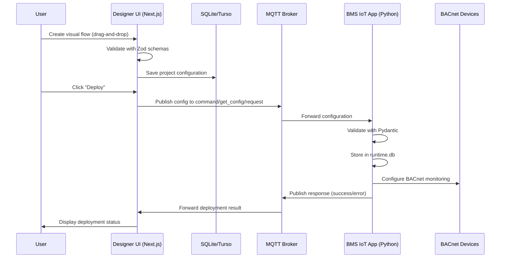
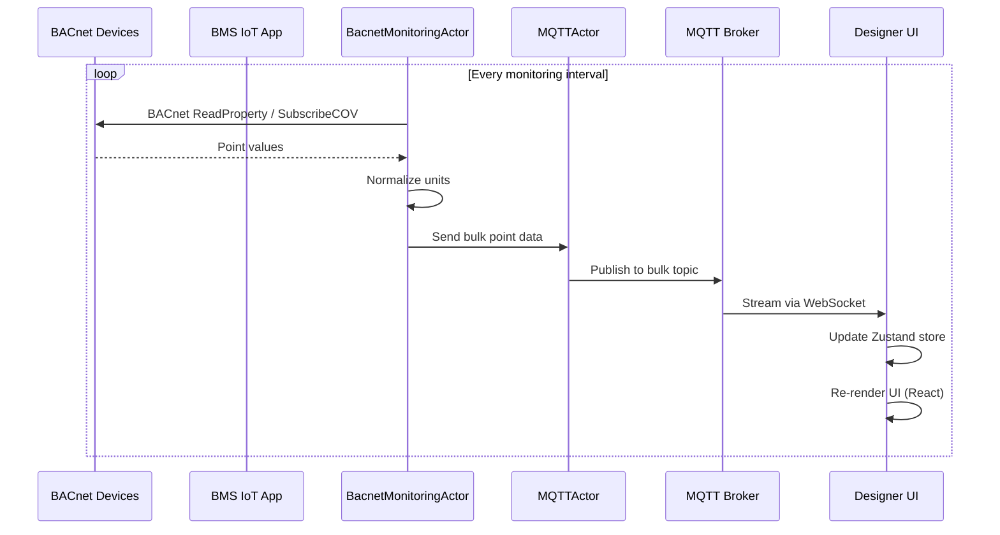
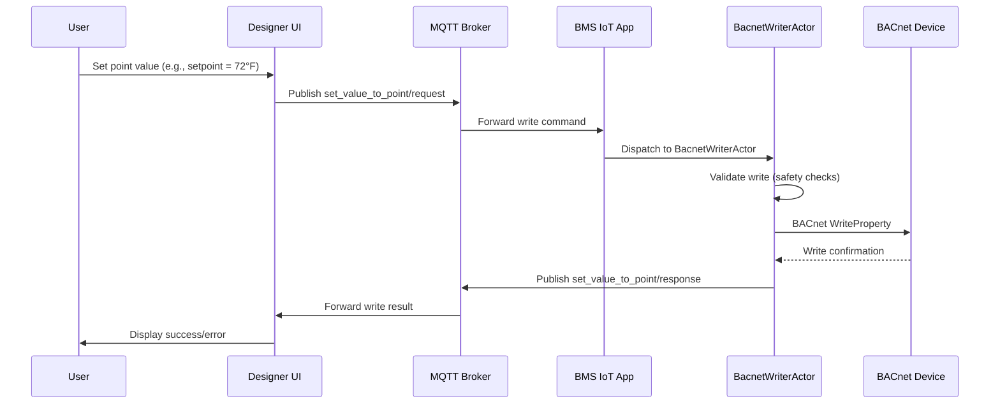

# BMS Supervisor Controller — Architecture

**Last Updated:** 2025-12-03
**Status:** Living Document (reflects current + planned architecture)

---

## Overview

Visual programming platform for building management systems with BACnet/MQTT IoT device integration. The system enables drag-and-drop control logic creation, real-time device monitoring, and semantic modeling using ASHRAE 223P.

**Current Phase:** Phase 6/8 - Persistence & Integration

---

## Architecture Vision

### Domain-First Architecture

The system is organized around **business domains**, not technology layers. Each domain is isolated with enforced boundaries to enable:

- **Independent evolution** - Change one domain without affecting others
- **Clear ownership** - Each domain has defined responsibilities
- **Swappable implementations** - Libraries are internal details, not contracts
- **Future micro-frontend support** - Domains can become separate deployables

### Apps Structure

```
apps/
├── designer/                    # Next.js - UI + domain frontends
├── bms-backend-api/             # Node.js - TypeScript backend (cron, notifications, historian) [future]
├── building-semantics-api/      # Python - Building Semantics domain
├── control-sequence-api/        # Python - Control Sequence domain
├── bms-iot-app/                 # Python - Device I/O domain
```

### Language Assignment

| Need                                   | Language   | Location                |
| -------------------------------------- | ---------- | ----------------------- |
| UI + frontend logic                    | TypeScript | Designer domains        |
| Backend business logic (no Python lib) | TypeScript | bms-backend-api domains |
| Cron/background jobs                   | TypeScript | bms-backend-api         |
| Domain requires Python library         | Python     | Dedicated Python API    |

### Python API = Domain Owner

Python APIs **own their domain**, not just wrap a library:

- The API defines domain operations and contracts
- Libraries are **implementation details** that can be swapped
- API contract stays stable even if underlying library changes
- Example: `building-semantics-api` could swap BuildingMOTIF for another RDF library without changing the API

### When to Create a Python API

| Condition                                               | Result                                   |
| ------------------------------------------------------- | ---------------------------------------- |
| Domain needs Python library (FMPy, BuildingMOTIF, BAC0) | Python API                               |
| Domain needs stateful process isolation (FMU memory)    | Python API                               |
| Otherwise                                               | TypeScript (Designer or bms-backend-api) |

---

## Domain Structure

### Domains Overview

| Domain                 | Description                                        | Language   | App                        |
| ---------------------- | -------------------------------------------------- | ---------- | -------------------------- |
| **Building Semantics** | ASHRAE 223P modeling, RDF graphs, SHACL validation | Python     | building-semantics-api     |
| **Control Sequence**   | G36 HVAC sequences, FMU execution                  | Python     | control-sequence-api       |
| **Device I/O**         | BACnet discovery, monitoring, MQTT                 | Python     | bms-iot-app                |
| **Graphics**           | SVG/Canvas visualization (future MFE)              | TypeScript | Designer                   |
| **Alarm**              | Alarm conditions, notifications (future MFE)       | TypeScript | Designer + bms-backend-api |
| **Flow Designer**      | Visual programming canvas                          | TypeScript | Designer                   |

### Domain Folder Pattern

**Consistent structure across all apps:**

**TypeScript Domains (Designer):**

```
src/domains/{domain-name}/
├── adapters/                # External service wrappers
├── api/                     # Generated clients, queries, mutations
│   └── generated/           # OpenAPI-generated types + client
├── components/              # UI components for this domain
├── services/                # Domain services
└── utils/                   # Helpers
```

**TypeScript Domains (bms-backend-api - Future):**

```
src/domains/{domain-name}/
├── controllers/             # Request handlers
├── services/                # Business logic
├── jobs/                    # Cron jobs (if applicable)
├── dto/                     # Data transfer objects
└── utils/                   # Helpers
```

**Python Domains:**

```
src/
├── adapters/                # Library implementations (swappable)
├── controllers/             # Business logic orchestration
├── dto/                     # Request/Response schemas (Pydantic)
├── models/                  # Domain models
├── routers/                 # FastAPI endpoints
├── config/                  # Settings
└── services/                # Cross-cutting concerns
```

---

## Decoupling Rules

### 1. API-Only Communication

Domains communicate **only via APIs** (REST, GraphQL, or Events):

```
✅ Designer → HTTP → building-semantics-api
✅ Designer → HTTP → control-sequence-api
✅ bms-backend-api → HTTP → control-sequence-api
❌ Direct import across domain boundaries
```

### 2. No Cross-Domain Database Access

Each domain owns its data:

```
✅ building-semantics-api owns RDF store
✅ control-sequence-api owns FMU instance state
✅ Designer owns project/flow database
❌ Domain A directly queries Domain B's database
```

### 3. Contract-First Development

API contracts are the **only interface** between domains:

1. Python API defines Pydantic DTOs
2. FastAPI generates OpenAPI spec
3. `openapi-ts` generates TypeScript client + types
4. Designer imports generated types

```
Python DTO → OpenAPI → TypeScript Types
(source of truth)     (generated, not manual)
```

### 4. Expose Domain Concepts, Not Library Internals

APIs should expose **what the domain does**, not **how the library works**.

**Bad - Leaky Abstraction (exposes library):**

```typescript
// Caller must know SPARQL and RDF concepts
const result = await api.runSparqlQuery(
  "SELECT ?s WHERE { ?s rdf:type s223:VAV }",
);
const graph = await api.getBuildingMotifModel(projectId);
```

If you swap BuildingMOTIF for another library, all callers must change.

**Good - Domain Abstraction:**

```typescript
// Caller only knows domain concepts
const vavUnits = await api.getEquipmentByType(projectId, "VAV");
const systems = await api.getSystems(projectId);
```

If you swap the library, only the adapter layer changes. Callers are unaffected.

### 5. Event-Driven Async Communication

For real-time updates, use MQTT pub/sub:

```
Device I/O → MQTT → Designer (telemetry)
Designer → MQTT → Device I/O (commands)
```

---

## System Architecture

### Domain-Aware Architecture

```
┌─────────────────────────────────────────────────────────────────────────┐
│                         Designer (Next.js)                               │
│  ┌─────────────────────────────────────────────────────────────────────┐│
│  │                         src/domains/                                 ││
│  │  ┌──────────────┐ ┌──────────────┐ ┌──────────────┐ ┌─────────────┐ ││
│  │  │ building-    │ │ control-     │ │  graphics    │ │   alarm     │ ││
│  │  │ semantics    │ │ sequence     │ │  (future)    │ │  (future)   │ ││
│  │  └──────┬───────┘ └──────┬───────┘ └──────────────┘ └─────────────┘ ││
│  └─────────┼────────────────┼──────────────────────────────────────────┘│
│            │ HTTP           │ HTTP                                       │
└────────────┼────────────────┼────────────────────────────────────────────┘
             ▼                ▼
┌────────────────────┐ ┌────────────────────┐
│ building-semantics │ │ control-sequence   │
│ -api (Python)      │ │ -api (Python)      │
│                    │ │                    │
│ • 223P modeling    │ │ • G36 sequences    │
│ • RDF/SHACL        │ │ • FMU execution    │
│                    │ │                    │
│ Library:           │ │ Library:           │
│ BuildingMOTIF      │ │ FMPy              │
└────────────────────┘ └────────────────────┘
```

### MQTT + Data Flow

```
┌──────────────────┐         HTTP          ┌──────────────────┐
│     Designer     │◄─────────────────────►│  bms-backend-api │
│                  │  (query history/agg)  │     (future)     │
│ • UI telemetry   │                       │                  │
│ • Send commands  │                       │ • Historian      │
│                  │                       │ • Aggregation    │
│                  │                       │ • Exposes API    │
└────────┬─────────┘                       └────────┬─────────┘
         │                                          │
         │ MQTT (telemetry, commands)               │ MQTT (subscribe, sink)
         │                                          │
         └──────────────────┬───────────────────────┘
                            ▼
                ┌───────────────────────┐
                │     MQTT Broker       │
                └───────────────────────┘
                            ▲
                            │ MQTT (publish telemetry, recv commands)
                            │
                ┌───────────────────────┐
                │     bms-iot-app       │
                │                       │
                │ • BACnet polling      │
                │ • Publish to MQTT     │
                │ • Only app that talks │
                │   to physical devices │
                └───────────┬───────────┘
                            │ BACnet/IP
                            ▼
                ┌───────────────────────┐
                │    BACnet Devices     │
                └───────────────────────┘
```

### Future: bms-backend-api (TypeScript)

```
┌─────────────────────────────────────────────────────────────────────────┐
│                      bms-backend-api (Node.js)                           │
│  ┌─────────────────────────────────────────────────────────────────────┐│
│  │                         src/domains/                                 ││
│  │  ┌──────────────┐ ┌──────────────┐ ┌──────────────┐                 ││
│  │  │  historian   │ │ notification │ │   future     │                 ││
│  │  │  • MQTT sub  │ │  • alerts    │ │   domains    │                 ││
│  │  │  • aggregate │ │  • delivery  │ │              │                 ││
│  │  │  • HTTP API  │ │              │ │              │                 ││
│  │  └──────────────┘ └──────────────┘ └──────────────┘                 ││
│  └─────────────────────────────────────────────────────────────────────┘│
└─────────────────────────────────────────────────────────────────────────┘
```

### Communication Patterns

| From            | To              | Protocol  | Purpose                              |
| --------------- | --------------- | --------- | ------------------------------------ |
| Designer        | Python APIs     | HTTP      | Request/response (CRUD, queries)     |
| Designer        | bms-backend-api | HTTP      | Query historical/aggregated data     |
| Designer        | MQTT Broker     | MQTT      | Real-time telemetry, send commands   |
| bms-backend-api | MQTT Broker     | MQTT      | Subscribe to sink and aggregate data |
| bms-iot-app     | MQTT Broker     | MQTT      | Publish telemetry, receive commands  |
| bms-iot-app     | BACnet Devices  | BACnet/IP | Device polling, writes (only app)    |

### Current Implementation Status

| App                    | Status         | Description                                         |
| ---------------------- | -------------- | --------------------------------------------------- |
| designer               | ✅ Implemented | Visual programming, project management, MQTT client |
| building-semantics-api | ✅ Implemented | ASHRAE 223P modeling, templates                     |
| control-sequence-api   | 🚧 In Progress | G36 FMU execution                                   |
| bms-iot-app            | ✅ Implemented | BACnet discovery, monitoring, MQTT                  |
| bms-backend-api        | 📋 Planned     | Historian, notifications, cron jobs, HTTP API       |

---

## Technology Stack

### Frontend (Designer App)

**Location:** `apps/designer/`

**Core Technologies:**

- **Next.js 15.5** with Turbopack
- **React 19.1** (React Server Components)
- **TypeScript** with strict type checking

**Visual Programming:**

- **React Flow (@xyflow/react 12.8)** - Canvas, nodes, edges
- **Zustand** - State management
- **Zod** - Schema validation & type safety

**Database:**

- **Drizzle ORM** with SQLite (local) or Turso/libSQL (remote)
- **better-sqlite3** for local development
- **@libsql/client** for Turso (Vercel deployment)

**Real-Time Communication:**

- **MQTT.js** - MQTT client for browser (WebSocket transport)
- **RxJS** - Reactive streams for real-time data

**UI Framework:**

- **shadcn/ui** (Radix UI primitives + Tailwind CSS)
- **Tailwind CSS v4**
- **Lucide React** - Icons

**Data Fetching:**

- **TanStack Query** - Async state management, caching

**Code Editor:**

- **Monaco Editor** - In-browser code editing (function nodes)

**Testing:**

- **Jest + React Testing Library** (306 test files)
- **Testing Library User Event** - Interaction testing

**Build & Dev:**

- **Turbopack** - Fast development builds
- **PNPM** - Package manager

---

### Backend (BMS IoT App)

**Location:** `apps/bms-iot-app/`

**Runtime:**

- **Python 3.11+** with asyncio

**Architecture:**

- **Custom Actor Model** (asyncio-based, not Pykka/Trio)
- Supervised actors for BACnet monitoring, MQTT, heartbeat, system metrics

**BACnet Protocol:**

- **BAC0 (2025.06.10)** - BACnet/IP client
- **bacpypes3** - BACnet protocol stack

**MQTT:**

- **paho-mqtt** - MQTT pub/sub client
- Topic-based command/response patterns

**Database:**

- **SQLModel** - SQLAlchemy + Pydantic integration
- **SQLite** with WAL mode (runtime cache, device discovery)

**Validation & DTOs:**

- **Pydantic 2.5** - Data validation, serialization

**CLI:**

- **Typer** - Command-line interface
- **Rich** - Terminal formatting

**Logging:**

- **Loguru** - Structured logging

**Testing:**

- **pytest** - Test framework (800+ tests)
- **pytest-asyncio** - Async test support
- **pytest-mock** - Mocking
- **pytest-cov** - Coverage reporting

**Concurrency:**

- **asyncio** - Event loop, coroutines
- **Actor Pattern** - Message-passing concurrency (custom implementation)

---

### Shared Infrastructure

**MQTT Topics Package:** `packages/mqtt_topics/`

- Dual TypeScript + Python implementation
- Shared topic definitions for Designer ↔ BMS IoT communication
- Type-safe topic builders

**Monorepo:**

- **PNPM workspaces** - Monorepo management
- Shared dependencies, unified scripts

---

## Architecture Patterns

### 1. Actor Model (BMS IoT App)

**Pattern:** Message-passing concurrency using asyncio actors

**Actors:**

- `BacnetMonitoringActor` - BACnet device monitoring (reads, COV subscriptions)
- `BacnetWriterActor` - BACnet write operations
- `MQTTActor` - MQTT message handling (pub/sub)
- `HeartbeatActor` - Periodic health checks
- `SystemMetricsActor` - Resource monitoring (CPU, memory)
- `UploaderActor` - Bulk data publishing
- `CleanerActor` - Database cleanup

**Message Queue:**

- `ActorQueueRegistry` - Centralized message routing
- Type-safe message passing (`ActorMessage` with payloads)
- Supervision: `supervise_actor()` with automatic restarts

**Benefits:**

- Isolation (actors don't share state)
- Fault tolerance (supervised restart on crash)
- Scalability (independent actor lifecycle)

---

### 2. Event-Driven Architecture (MQTT)

**Pattern:** Pub/sub messaging for decoupled communication

**Topic Structure:**

```
iot/global/{org_id}/{site_id}/{iot_device_id}/command/{command_name}/request
iot/global/{org_id}/{site_id}/{iot_device_id}/command/{command_name}/response
iot/global/{org_id}/{site_id}/{iot_device_id}/status/update
iot/global/{org_id}/{site_id}/{iot_device_id}/status/heartbeat
iot/global/{org_id}/{site_id}/{iot_device_id}/bulk
iot/global/{org_id}/{site_id}/{iot_device_id}/{controller_id}/{point_id}
```

**Communication Patterns:**

1. **Command/Response** (Request-Reply over MQTT)

   - Designer publishes command request
   - BMS IoT processes, publishes response
   - Correlation via message IDs

2. **Telemetry Streaming** (Pub/Sub)

   - BMS IoT publishes point data to bulk topics
   - Designer subscribes for real-time updates
   - QoS 0 (best effort) or QoS 1 (at least once)

3. **Status Updates** (Retained Messages)
   - Heartbeat published periodically (QoS 1, retained)
   - Status updates on connection state changes

**Benefits:**

- Decoupling (services independent)
- Real-time (low latency updates)
- Scalability (add subscribers without publisher changes)

---

### 3. Reactive State Management (Designer)

**Pattern:** Zustand + RxJS for reactive UI

**Zustand Stores:**

- `useFlowStore` - Visual programming canvas state
- `useProjectStore` - Project metadata
- `use223pStore` - ASHRAE 223P mappings (future)

**RxJS Streams:**

- MQTT message streams
- Real-time point value updates
- Status change notifications

**Benefits:**

- Reactive (UI auto-updates on state change)
- Predictable (single source of truth)
- Performant (granular subscriptions, minimal re-renders)

---

### 4. Schema-Driven Validation

**Pattern:** Zod (TypeScript) + Pydantic (Python) for type safety

**Zod Schemas (Designer):**

```typescript
// apps/designer/src/lib/schemas/nodes/types.ts
export const NodeTypeSchema = z.enum([
  "input.sensor",
  "input.manual",
  "logic.compare",
  "output.actuator",
  // ... 12 node types
]);

export type NodeType = z.infer<typeof NodeTypeSchema>;
```

**Pydantic Models (BMS IoT):**

```python
# apps/bms-iot-app/src/dto/controller_point_dto.py
class ControllerPointDTO(BaseModel):
    point_id: str
    organization_id: str
    site_id: str
    device_id: str
    node_type: str
    value: float
    timestamp: datetime
```

**Current Challenge:**

- Manual synchronization between Zod (TS) and Pydantic (Python)
- Risk of type drift

**Future Solution (Tech Debt):**

- Hybrid approach: OpenAPI for APIs, JSON Schema for MQTT
- See: `/docs/research/2025-10-31-type-safety-strategy-polyglot-architecture.md`

---

### 5. Clean Architecture (Layers)

**Pattern:** Separation of concerns with clear boundaries

**Designer (TypeScript):**

```
src/
├── app/               # Next.js routes (UI layer)
├── components/        # React components (UI layer)
├── lib/
│   ├── schemas/       # Zod schemas (validation layer)
│   ├── db/            # Drizzle ORM (data layer)
│   │   ├── schema/    # Database schema definitions
│   │   └── models/    # Query functions
│   ├── domain/        # Business logic
│   │   ├── models/    # Domain entities
│   │   └── mappers/   # DTO ↔ Domain mapping
│   ├── api/           # External API clients
│   ├── mqtt/          # MQTT communication layer
│   └── services/      # Application services
├── store/             # Zustand state management
└── types/             # TypeScript type definitions
```

**BMS IoT App (Python):**

```
src/
├── actors/            # Actor model (concurrency layer)
├── controllers/       # Business logic
│   ├── monitoring/    # BACnet monitoring
│   ├── mqtt/          # MQTT handlers
│   └── bacnet_writer/ # BACnet write operations
├── dto/               # Data Transfer Objects
├── models/            # Database models (SQLModel)
├── network/           # External communication
│   ├── mqtt_client.py
│   └── mqtt_command_dispatcher.py
├── utils/             # Utilities (logging, helpers)
├── config/            # Configuration management
└── main.py            # Application entry point
```

**Benefits:**

- Testability (mock boundaries easily)
- Maintainability (changes localized)
- Scalability (add layers without touching others)

---

### 6. Multi-Tenancy Hierarchy

**Pattern:** Organization → Site → Device hierarchy

**Data Model:**

```
Organization
  └─ Sites
      └─ IoT Devices (edge devices running BMS IoT App)
          └─ BACnet Readers (device configurations)
              └─ Controller Points (BACnet points)
```

**Routing:**

- MQTT topics include `{org_id}/{site_id}/{iot_device_id}`
- Database queries scoped by organization/site
- API routes enforce ownership checks

**Benefits:**

- Isolation (tenants separated)
- Scalability (add orgs/sites without code changes)
- Security (access control at org/site level)

---

## Data Flow Examples

### 1. Visual Flow Deployment (Designer → BMS IoT)


```mermaid
sequenceDiagram
    participant User
    participant Designer as Designer UI (Next.js)
    participant DB as SQLite/Turso
    participant MQTT as MQTT Broker
    participant IoT as BMS IoT App (Python)
    participant BACnet as BACnet Devices

    User->>Designer: Create visual flow (drag-and-drop)
    Designer->>Designer: Validate with Zod schemas
    Designer->>DB: Save project configuration
    User->>Designer: Click "Deploy"
    Designer->>MQTT: Publish config to command/get_config/request
    MQTT->>IoT: Forward configuration
    IoT->>IoT: Validate with Pydantic
    IoT->>IoT: Store in runtime.db
    IoT->>BACnet: Configure BACnet monitoring
    IoT->>MQTT: Publish response (success/error)
    MQTT->>Designer: Forward deployment result
    Designer->>User: Display deployment status
```

---

### 2. Real-Time Monitoring (BMS IoT → Designer)


```mermaid
sequenceDiagram
    participant BACnet as BACnet Devices
    participant IoT as BMS IoT App
    participant Monitor as BacnetMonitoringActor
    participant MQTT as MQTTActor
    participant Broker as MQTT Broker
    participant Designer as Designer UI

    loop Every monitoring interval
        Monitor->>BACnet: BACnet ReadProperty / SubscribeCOV
        BACnet-->>Monitor: Point values
        Monitor->>Monitor: Normalize units
        Monitor->>MQTT: Send bulk point data
        MQTT->>Broker: Publish to bulk topic
        Broker->>Designer: Stream via WebSocket
        Designer->>Designer: Update Zustand store
        Designer->>Designer: Re-render UI (React)
    end
```

---

### 3. BACnet Write Operation (Designer → Device)


```mermaid
sequenceDiagram
    participant User
    participant Designer as Designer UI
    participant Broker as MQTT Broker
    participant IoT as BMS IoT App
    participant Writer as BacnetWriterActor
    participant BACnet as BACnet Device

    User->>Designer: Set point value (e.g., setpoint = 72°F)
    Designer->>Broker: Publish set_value_to_point/request
    Broker->>IoT: Forward write command
    IoT->>Writer: Dispatch to BacnetWriterActor
    Writer->>Writer: Validate write (safety checks)
    Writer->>BACnet: BACnet WriteProperty
    BACnet-->>Writer: Write confirmation
    Writer->>Broker: Publish set_value_to_point/response
    Broker->>Designer: Forward write result
    Designer->>User: Display success/error
```

---

## Database Schema

### Designer Database (`designer.db`)

**Ownership:** Designer app (read/write)

**Tables (Drizzle ORM):**

1. **organizations** - Tenant isolation

   ```typescript
   {
     id: string(UUID);
     name: string;
     created_at: timestamp;
   }
   ```

2. **sites** - Building locations

   ```typescript
   {
     id: string(UUID);
     organization_id: string(FK);
     name: string;
     address: string;
     created_at: timestamp;
   }
   ```

3. **iot_devices** - Edge devices

   ```typescript
   {
     id: string (UUID)
     organization_id: string (FK)
     site_id: string (FK)
     name: string
     status: enum ('online', 'offline', 'error')
     last_seen: timestamp
   }
   ```

4. **projects** - Visual programming projects

   ```typescript
   {
     id: string (UUID)
     organization_id: string (FK)
     site_id: string (FK)
     name: string
     description: string
     flow_json: json (React Flow graph)
     created_at: timestamp
     updated_at: timestamp
   }
   ```

5. **bacnet_readers** - BACnet device configurations

   ```typescript
   {
     id: string(UUID);
     organization_id: string(FK);
     site_id: string(FK);
     iot_device_id: string(FK);
     name: string;
     ip_address: string;
     port: number;
     device_id: number;
     enabled: boolean;
   }
   ```

6. **iot_device_controllers** - BACnet controllers

   ```typescript
   {
     id: string(UUID);
     organization_id: string(FK);
     site_id: string(FK);
     bacnet_reader_id: string(FK);
     name: string;
     device_instance: number;
     vendor_name: string;
   }
   ```

7. **controller_points** - BACnet points

   ```typescript
   {
     id: string(UUID);
     organization_id: string(FK);
     site_id: string(FK);
     controller_id: string(FK);
     point_name: string;
     object_type: string;
     object_instance: number;
     units: string;
     metadata: json;
   }
   ```

8. **iot_device_configs** - Deployment configurations
   ```typescript
   {
     id: string(UUID);
     iot_device_id: string(FK);
     config_json: json;
     version: number;
     deployed_at: timestamp;
   }
   ```

---

### BMS IoT App Database (`runtime.db`)

**Ownership:** BMS IoT App (read/write)

**Tables (SQLModel):**

1. **bacnet_config** - BACnet device configurations
2. **controller_points** - Cached BACnet point metadata
3. **iot_device_status** - Runtime health status
4. **deployment_config** - Current deployment settings

**Storage Pattern:**

- SQLite with WAL mode (Write-Ahead Logging)
- Short-term caching (discovery results, last values)
- No long-term historical data (use external time-series DB)

---

## Security Considerations

### Current Security Model

**Designer App:**

- Localhost development (no auth)
- Vercel deployment (TBD: add authentication)
- Environment-based config (Turso credentials)

**BMS IoT App:**

- Localhost binding (internal use only)
- No external exposure (MQTT only)
- Configuration via CLI/environment variables

**MQTT:**

- No authentication (local development)
- Future: TLS + username/password for production

### Future Security Enhancements

1. **Authentication & Authorization**

   - JWT tokens for Designer API
   - RBAC (Role-Based Access Control) for multi-tenancy
   - OAuth/OIDC for enterprise SSO

2. **Network Security**

   - TLS for MQTT connections
   - mTLS for service-to-service communication
   - VPN/firewall for BACnet network isolation

3. **Data Security**

   - Encryption at rest (SQLite encryption)
   - Audit logging (write operations, config changes)
   - Secure credential storage (secrets management)

4. **BACnet Security**
   - Write interlocks (prevent unsafe writes)
   - Rate limiting (prevent DoS on devices)
   - Value range validation (prevent out-of-range writes)

---

## Testing Strategy

### Designer App (TypeScript)

**Unit Tests:** 306 test files (Jest + React Testing Library)

**Coverage:**

- Zod schemas (`*.spec.ts` files)
- React components (`*.test.tsx` files)
- Database models (`*.spec.ts` files)
- Domain mappers (`*.spec.ts` files)

**Test Patterns:**

```typescript
// Schema validation tests
describe('NodeTypeSchema', () => {
  it('should accept valid node types', () => {
    expect(NodeTypeSchema.parse('input.sensor')).toBe('input.sensor')
  })

  it('should reject invalid node types', () => {
    expect(() => NodeTypeSchema.parse('invalid')).toThrow()
  })
})

// Component tests
describe('FlowCanvas', () => {
  it('should render nodes and edges', () => {
    render(<FlowCanvas nodes={mockNodes} edges={mockEdges} />)
    expect(screen.getByText('Sensor Node')).toBeInTheDocument()
  })
})
```

---

### BMS IoT App (Python)

**Test Suite:** 800+ tests (pytest)

**Coverage:**

- Unit tests: `tests/unit/` (models, DTOs, controllers)
- Integration tests: `tests/integration/` (MQTT, BACnet, actors)

**Test Patterns:**

```python
# Unit tests
def test_controller_point_dto_serialization():
    dto = ControllerPointDTO(
        point_id="p1",
        organization_id="org1",
        site_id="site1",
        device_id="dev1",
        node_type="input.sensor",
        value=72.5
    )
    assert dto.model_dump()["value"] == 72.5

# Integration tests (with isolation)
@pytest.mark.isolate
async def test_mqtt_correlation_flow():
    # Test complete MQTT request/response flow
    pass
```

**Test Infrastructure:**

- `pytest-asyncio` for async tests
- `pytest-mock` for mocking external dependencies
- `pytest-isolate` for subprocess isolation (heavy tests)
- BACnet simulator for protocol testing

---

## Deployment

### Current: Local Development

**Designer:**

```bash
cd apps/designer
pnpm dev  # http://localhost:3000
```

**BMS IoT App:**

```bash
pnpm bms-iot:run  # Starts Python asyncio app
```

---

### Future: Production Deployment

**Designer (Vercel):**

- Serverless Next.js deployment
- Turso database (remote SQLite)
- Environment variables for config
- Automatic HTTPS, CDN, edge functions

**BMS IoT App (Edge Device):**

- Docker container (planned)
- Systemd service (Linux)
- Automatic restart on failure
- Log aggregation (journald)

**MQTT Broker (Planned):**

- NanoMQ or Mosquitto (local broker)
- Docker Compose for local development
- Cloud MQTT bridge for remote monitoring (optional)

---

## Near-Term Roadmap (Active Development)

### BuildingMOTIF Integration (Phase 1-3)

**Goal:** ASHRAE 223P semantic modeling + SHACL validation

**Spec:** `/docs/specs/2025-10-24-buildingmotif-integration-spec.md`

**Architecture:**

```
Designer UI (TypeScript)
  ↓ HTTP REST API
BuildingMOTIF Service (Python FastAPI)
  ├─ BuildingMOTIF SDK (RDF graphs, SHACL validation)
  ├─ Template Library (VAV, AHU, CHW systems)
  └─ Pydantic Models → OpenAPI → TypeScript types
```

**Integration Points:**

1. **223P Mapping Popup** (Designer UI)

   - Spec: `/docs/specs/2025-10-30-phase-1-223p-mapping-popup-spec.md`
   - AI-assisted BACnet → 223P point mapping
   - Equipment template selection (VAV, AHU, etc.)

2. **SHACL Validation** (BuildingMOTIF Service)

   - Validate equipment models (223P compliance)
   - Validate G36 sequences (require 223P points)

3. **Type Generation** (OpenAPI → TypeScript)
   ```bash
   npx openapi-typescript http://localhost:8000/openapi.json \
     -o src/lib/api/buildingmotif-types.ts
   ```

**Status:**

- Phase 0: ✅ Complete (schema cleanup)
- Phase 1-3: 🚧 In Progress

---

## Long-Term Future (Planned)

### 1. FMU/Modelica Integration

**Purpose:** G36 HVAC sequence simulation

**Technology:**

- Python + FMPy (Modelica FMU runtime)
- FastAPI for API endpoints
- Integration with visual programming canvas

**Use Cases:**

- Validate G36 control sequences
- Simulate equipment behavior
- Test control logic before deployment

---

### 2. AI Integration

**Purpose:** Intelligent BACnet → ASHRAE 223P mapping

**Technology:**

- Python + LLM API (OpenAI, Anthropic, etc.)
- Semantic analysis of BACnet object names
- Equipment template suggestions

**Use Cases:**

- Auto-map BACnet points to 223P equipment
- Learn from user corrections
- Suggest optimal control strategies

---

### 3. Cloud Monitoring (Optional)

**Purpose:** Multi-site dashboard, remote monitoring

**Architecture:**

```
Edge Devices (BMS IoT App)
  ↓ MQTT Bridge
Cloud MQTT Broker (EMQX)
  ↓
Cloud Monitoring Apps
  └─ Multi-site dashboard
  └─ Alerting & notifications
  └─ Historical data analytics
```

**Benefits:**

- Centralized monitoring across sites
- Remote troubleshooting
- Aggregated analytics

---

## Repository Structure

```
bms-supervisor-controller/
├── apps/
│   ├── designer/                    # Next.js - UI + domain frontends
│   │   ├── src/
│   │   │   ├── app/                 # Next.js routes + API routes
│   │   │   ├── components/          # Shared React components
│   │   │   ├── domains/             # Domain modules (see below)
│   │   │   │   ├── building-semantics/
│   │   │   │   ├── control-sequence/
│   │   │   │   ├── graphics/        # (future MFE)
│   │   │   │   └── alarm/           # (future MFE)
│   │   │   ├── lib/                 # Core logic, schemas, DB, MQTT
│   │   │   ├── store/               # Zustand state management
│   │   │   └── types/               # TypeScript types
│   │   ├── drizzle.config.ts
│   │   └── package.json
│   │
│   ├── building-semantics-api/      # Python - Building Semantics domain
│   │   ├── src/
│   │   │   ├── adapters/            # Library wrappers (swappable)
│   │   │   ├── controllers/         # Business logic
│   │   │   ├── dto/                 # Pydantic DTOs
│   │   │   ├── models/              # Domain models
│   │   │   └── routers/             # FastAPI endpoints
│   │   └── tests/
│   │
│   ├── control-sequence-api/        # Python - Control Sequence domain
│   │   ├── src/                     # (same structure as above)
│   │   └── tests/
│   │
│   ├── bms-iot-app/                 # Python - Device I/O domain
│   │   ├── src/
│   │   │   ├── actors/              # Actor model (asyncio)
│   │   │   ├── controllers/         # Business logic
│   │   │   ├── dto/                 # Pydantic DTOs
│   │   │   ├── models/              # SQLModel (database)
│   │   │   ├── network/             # MQTT client
│   │   │   └── main.py
│   │   └── tests/
│   │
│   └── bms-backend-api/             # Node.js - TypeScript backend (future)
│       ├── src/
│       │   └── domains/
│       │       ├── historian/       # Data aggregation, cron
│       │       └── notification/    # Alerts, delivery
│       └── tests/
│
├── packages/
│   └── mqtt_topics/                 # Shared MQTT topic definitions
│       ├── src/                     # TypeScript implementation
│       └── python/                  # Python implementation
│
├── docs/
│   ├── architecture.md              # This file
│   ├── coding-standards.md
│   └── specs/
│
├── CLAUDE.md
├── README.md
├── package.json
└── pnpm-workspace.yaml
```

---

## Future: Micro-Frontends

### Vision

Graphics and Alarm domains will evolve into separate micro-frontends (MFEs), enabling:

- **Independent deployment** - Release graphics fixes without touching alarm
- **Team autonomy** - Different teams can own different MFEs
- **Technology flexibility** - Each MFE can evolve independently

### Migration Path

```
Current:
┌─────────────────────────────────────────────┐
│              Designer (Next.js)              │
│  ┌─────────┐ ┌─────────┐ ┌─────────┐       │
│  │graphics │ │  alarm  │ │  flow   │       │
│  │ domain  │ │ domain  │ │ designer│       │
│  └─────────┘ └─────────┘ └─────────┘       │
└─────────────────────────────────────────────┘

Future:
┌─────────────────────────────────────────────┐
│              Shell App (Router)              │
└─────────────────────────────────────────────┘
       │              │              │
       ▼              ▼              ▼
┌───────────┐  ┌───────────┐  ┌───────────┐
│ Graphics  │  │   Alarm   │  │ Designer  │
│   MFE     │  │    MFE    │  │   MFE     │
└───────────┘  └───────────┘  └───────────┘
```

### Technology Decision

Shell technology (Module Federation, single-spa, etc.) to be decided when MFE migration begins. Current domain structure in Designer prepares for this transition.

### MFE API Pattern

Each MFE will have its own Next.js API routes:

- `/api/graphics/...` - Graphics MFE API
- `/api/alarm/...` - Alarm MFE API
- `/api/flows/...` - Designer MFE API

---

## Key Design Principles

### 1. Test-Driven Development (TDD)

- Write tests first, then implement
- Red-Green-Refactor cycle
- 306 TS tests + 800+ Python tests

### 2. Don't Overengineer

- Simple, direct implementations
- Avoid premature abstractions
- Minimal viable solutions that evolve

### 3. Fail Fast

- Surface issues immediately
- Clear error messages
- Quick feedback loops

### 4. Schema-Driven Validation

- Zod for TypeScript (compile-time + runtime)
- Pydantic for Python (runtime validation)
- Type safety across boundaries

### 5. Actor Model for Concurrency

- Message-passing (no shared state)
- Supervised actors (automatic restart)
- Isolation (fault tolerance)

---

## Performance Characteristics

**Designer UI:**

- 60fps canvas interactions (React Flow)
- < 100ms UI response time
- Real-time MQTT updates (< 500ms latency)

**BMS IoT App:**

- BACnet read cycle: 1-5 seconds (configurable)
- MQTT publish latency: < 50ms
- Actor message processing: < 10ms
- Database writes: < 100ms (SQLite WAL)

**Scalability:**

- Devices per site: 10-100 (tested)
- Points per device: 100-1000 (tested)
- Concurrent users: 1-10 (Designer UI)

---

## Known Limitations

### Current

1. **Type Synchronization** (Zod ↔ Pydantic)

   - Manual synchronization required
   - Risk of type drift
   - **Solution:** Tech debt documented in research report

2. **No Authentication** (Designer)

   - Localhost development only
   - No multi-user support yet

3. **No Historical Data Storage**

   - Only real-time + short-term cache
   - No time-series database integration

4. **BACnet-Only Protocol Support**
   - No Modbus, KNX, or other protocols
   - BACnet/IP only (no BACnet MSTP)

### Future Enhancements

- Authentication & authorization (JWT, RBAC)
- Time-series database integration (InfluxDB, TimescaleDB)
- Additional protocol support (Modbus, KNX)
- Cloud sync & multi-site monitoring
- Mobile app (React Native)

---

## References

**Technology Documentation:**

- Next.js: https://nextjs.org/docs
- React Flow: https://reactflow.dev/
- Drizzle ORM: https://orm.drizzle.team/
- Zustand: https://github.com/pmndrs/zustand
- Zod: https://zod.dev/
- FastAPI: https://fastapi.tiangolo.com/
- Pydantic: https://docs.pydantic.dev/
- BAC0: https://bac0.readthedocs.io/
- paho-mqtt: https://eclipse.dev/paho/

**Project Specs:**

- BuildingMOTIF Integration: `/docs/specs/2025-10-24-buildingmotif-integration-spec.md`
- ASHRAE 223P Mapping UI: `/docs/specs/2025-10-30-phase-1-223p-mapping-popup-spec.md`

**Research:**

- Type Safety Strategy: `/docs/research/2025-10-31-type-safety-strategy-polyglot-architecture.md`

**Standards:**

- ASHRAE 223P: https://open223.info/
- BACnet Protocol: http://www.bacnet.org/

---

## Document History

- **2025-12-03:** Added Architecture Vision - domain-first architecture with enforced decoupling, domain structure patterns, bms-backend-api for TypeScript cron/notifications, MFE roadmap for Graphics and Alarm domains
- **2025-10-31:** Major update - verified from actual codebase, removed planned components that don't exist, added BuildingMOTIF near-term plans
- **Previous:** Draft architecture (planned components, headless engine, supervisor-engine package)

---

_This architecture document reflects the **actual implemented system** (verified from codebase analysis) plus **active near-term development** (BuildingMOTIF integration). Future/planned components are clearly marked._
