# BMS Supervisor Controller — Architecture

**Last Updated:** 2025-10-31 (verified from codebase)
**Status:** Living Document (reflects current + planned architecture)

---

## Overview

Visual programming platform for building management systems with BACnet/MQTT IoT device integration. The system enables drag-and-drop control logic creation, real-time device monitoring, and semantic modeling using ASHRAE 223P.

**Current Phase:** Phase 6/8 - Persistence & Integration

---

## System Architecture

### Current Components (Implemented)

```
┌─────────────────────────────────────────────────────────────┐
│                    Designer App (Next.js)                   │
│  - Visual programming interface (React Flow)                │
│  - Project management & validation (Zod schemas)            │
│  - Real-time device monitoring (MQTT.js client)             │
│  - Database: SQLite (local) / Turso (remote, Vercel)        │
└──────────────────┬──────────────────────────────────────────┘
                   │ MQTT (paho-mqtt / MQTT.js)
                   │ JSON messages
                   ↓
┌─────────────────────────────────────────────────────────────┐
│            BMS IoT App (Python asyncio actors)              │
│  - BACnet device discovery & monitoring (BAC0, bacpypes3)   │
│  - Actor-based concurrency (asyncio-based actors)           │
│  - MQTT pub/sub messaging (paho-mqtt)                       │
│  - Database: SQLite (local runtime cache)                   │
│  - CLI interface (Typer)                                    │
└──────────────────┬──────────────────────────────────────────┘
                   │ BACnet/IP
                   ↓
           ┌───────────────────┐
           │  BACnet Devices   │
           │  (Controllers,    │
           │   Sensors, etc.)  │
           └───────────────────┘
```

### Near-Term Planned (Active Development)

```
┌─────────────────────────────────────────────────────────────┐
│              BuildingMOTIF Service (FastAPI)                │
│  - ASHRAE 223P semantic modeling (RDF graphs)               │
│  - SHACL validation (equipment, G36 sequences)              │
│  - Template library (VAV, AHU, CHW, etc.)                   │
│  - RESTful API (Pydantic → OpenAPI → TypeScript types)      │
│  ↑                                                           │
│  └─ Designer integrates via generated TypeScript client     │
└─────────────────────────────────────────────────────────────┘

Spec: /docs/specs/2025-10-24-buildingmotif-integration-spec.md
Status: Phase 0 complete, Phase 1-3 in progress
```

### Long-Term Future (Planned)

```
┌─────────────────────────────────────────────────────────────┐
│        FMU/Modelica Service (Python + PyFMI)                │
│  - G36 HVAC sequence simulation                             │
│  - Functional Mock-up Interface (FMU) runtime               │
│  - Control logic validation                                 │
└─────────────────────────────────────────────────────────────┘

┌─────────────────────────────────────────────────────────────┐
│          AI Integration Service (Python + LLM)              │
│  - ASHRAE 223P → BACnet point mapping suggestions           │
│  - Semantic analysis of BACnet metadata                     │
│  - Equipment template recommendations                        │
└─────────────────────────────────────────────────────────────┘
```

---

## Technology Stack

### Frontend (Designer App)

**Location:** `apps/designer/`

**Core Technologies:**

- **Next.js 15.5** with Turbopack
- **React 19.1** (React Server Components)
- **TypeScript** with strict type checking

**Visual Programming:**

- **React Flow (@xyflow/react 12.8)** - Canvas, nodes, edges
- **Zustand** - State management
- **Zod** - Schema validation & type safety

**Database:**

- **Drizzle ORM** with SQLite (local) or Turso/libSQL (remote)
- **better-sqlite3** for local development
- **@libsql/client** for Turso (Vercel deployment)

**Real-Time Communication:**

- **MQTT.js** - MQTT client for browser (WebSocket transport)
- **RxJS** - Reactive streams for real-time data

**UI Framework:**

- **shadcn/ui** (Radix UI primitives + Tailwind CSS)
- **Tailwind CSS v4**
- **Lucide React** - Icons

**Data Fetching:**

- **TanStack Query** - Async state management, caching

**Code Editor:**

- **Monaco Editor** - In-browser code editing (function nodes)

**Testing:**

- **Jest + React Testing Library** (306 test files)
- **Testing Library User Event** - Interaction testing

**Build & Dev:**

- **Turbopack** - Fast development builds
- **PNPM** - Package manager

---

### Backend (BMS IoT App)

**Location:** `apps/bms-iot-app/`

**Runtime:**

- **Python 3.11+** with asyncio

**Architecture:**

- **Custom Actor Model** (asyncio-based, not Pykka/Trio)
- Supervised actors for BACnet monitoring, MQTT, heartbeat, system metrics

**BACnet Protocol:**

- **BAC0 (2025.06.10)** - BACnet/IP client
- **bacpypes3** - BACnet protocol stack

**MQTT:**

- **paho-mqtt** - MQTT pub/sub client
- Topic-based command/response patterns

**Database:**

- **SQLModel** - SQLAlchemy + Pydantic integration
- **SQLite** with WAL mode (runtime cache, device discovery)

**Validation & DTOs:**

- **Pydantic 2.5** - Data validation, serialization

**CLI:**

- **Typer** - Command-line interface
- **Rich** - Terminal formatting

**Logging:**

- **Loguru** - Structured logging

**Testing:**

- **pytest** - Test framework (800+ tests)
- **pytest-asyncio** - Async test support
- **pytest-mock** - Mocking
- **pytest-cov** - Coverage reporting

**Concurrency:**

- **asyncio** - Event loop, coroutines
- **Actor Pattern** - Message-passing concurrency (custom implementation)

---

### Shared Infrastructure

**MQTT Topics Package:** `packages/mqtt_topics/`

- Dual TypeScript + Python implementation
- Shared topic definitions for Designer ↔ BMS IoT communication
- Type-safe topic builders

**Monorepo:**

- **PNPM workspaces** - Monorepo management
- Shared dependencies, unified scripts

---

## Architecture Patterns

### 1. Actor Model (BMS IoT App)

**Pattern:** Message-passing concurrency using asyncio actors

**Actors:**

- `BacnetMonitoringActor` - BACnet device monitoring (reads, COV subscriptions)
- `BacnetWriterActor` - BACnet write operations
- `MQTTActor` - MQTT message handling (pub/sub)
- `HeartbeatActor` - Periodic health checks
- `SystemMetricsActor` - Resource monitoring (CPU, memory)
- `UploaderActor` - Bulk data publishing
- `CleanerActor` - Database cleanup

**Message Queue:**

- `ActorQueueRegistry` - Centralized message routing
- Type-safe message passing (`ActorMessage` with payloads)
- Supervision: `supervise_actor()` with automatic restarts

**Benefits:**

- Isolation (actors don't share state)
- Fault tolerance (supervised restart on crash)
- Scalability (independent actor lifecycle)

---

### 2. Event-Driven Architecture (MQTT)

**Pattern:** Pub/sub messaging for decoupled communication

**Topic Structure:**

```
iot/global/{org_id}/{site_id}/{iot_device_id}/command/{command_name}/request
iot/global/{org_id}/{site_id}/{iot_device_id}/command/{command_name}/response
iot/global/{org_id}/{site_id}/{iot_device_id}/status/update
iot/global/{org_id}/{site_id}/{iot_device_id}/status/heartbeat
iot/global/{org_id}/{site_id}/{iot_device_id}/bulk
iot/global/{org_id}/{site_id}/{iot_device_id}/{controller_id}/{point_id}
```

**Communication Patterns:**

1. **Command/Response** (Request-Reply over MQTT)

   - Designer publishes command request
   - BMS IoT processes, publishes response
   - Correlation via message IDs

2. **Telemetry Streaming** (Pub/Sub)

   - BMS IoT publishes point data to bulk topics
   - Designer subscribes for real-time updates
   - QoS 0 (best effort) or QoS 1 (at least once)

3. **Status Updates** (Retained Messages)
   - Heartbeat published periodically (QoS 1, retained)
   - Status updates on connection state changes

**Benefits:**

- Decoupling (services independent)
- Real-time (low latency updates)
- Scalability (add subscribers without publisher changes)

---

### 3. Reactive State Management (Designer)

**Pattern:** Zustand + RxJS for reactive UI

**Zustand Stores:**

- `useFlowStore` - Visual programming canvas state
- `useProjectStore` - Project metadata
- `use223pStore` - ASHRAE 223P mappings (future)

**RxJS Streams:**

- MQTT message streams
- Real-time point value updates
- Status change notifications

**Benefits:**

- Reactive (UI auto-updates on state change)
- Predictable (single source of truth)
- Performant (granular subscriptions, minimal re-renders)

---

### 4. Schema-Driven Validation

**Pattern:** Zod (TypeScript) + Pydantic (Python) for type safety

**Zod Schemas (Designer):**

```typescript
// apps/designer/src/lib/schemas/nodes/types.ts
export const NodeTypeSchema = z.enum([
  "input.sensor",
  "input.manual",
  "logic.compare",
  "output.actuator",
  // ... 12 node types
]);

export type NodeType = z.infer<typeof NodeTypeSchema>;
```

**Pydantic Models (BMS IoT):**

```python
# apps/bms-iot-app/src/dto/controller_point_dto.py
class ControllerPointDTO(BaseModel):
    point_id: str
    organization_id: str
    site_id: str
    device_id: str
    node_type: str
    value: float
    timestamp: datetime
```

**Current Challenge:**

- Manual synchronization between Zod (TS) and Pydantic (Python)
- Risk of type drift

**Future Solution (Tech Debt):**

- Hybrid approach: OpenAPI for APIs, JSON Schema for MQTT
- See: `/docs/research/2025-10-31-type-safety-strategy-polyglot-architecture.md`

---

### 5. Clean Architecture (Layers)

**Pattern:** Separation of concerns with clear boundaries

**Designer (TypeScript):**

```
src/
├── app/               # Next.js routes (UI layer)
├── components/        # React components (UI layer)
├── lib/
│   ├── schemas/       # Zod schemas (validation layer)
│   ├── db/            # Drizzle ORM (data layer)
│   │   ├── schema/    # Database schema definitions
│   │   └── models/    # Query functions
│   ├── domain/        # Business logic
│   │   ├── models/    # Domain entities
│   │   └── mappers/   # DTO ↔ Domain mapping
│   ├── api/           # External API clients
│   ├── mqtt/          # MQTT communication layer
│   └── services/      # Application services
├── store/             # Zustand state management
└── types/             # TypeScript type definitions
```

**BMS IoT App (Python):**

```
src/
├── actors/            # Actor model (concurrency layer)
├── controllers/       # Business logic
│   ├── monitoring/    # BACnet monitoring
│   ├── mqtt/          # MQTT handlers
│   └── bacnet_writer/ # BACnet write operations
├── dto/               # Data Transfer Objects
├── models/            # Database models (SQLModel)
├── network/           # External communication
│   ├── mqtt_client.py
│   └── mqtt_command_dispatcher.py
├── utils/             # Utilities (logging, helpers)
├── config/            # Configuration management
└── main.py            # Application entry point
```

**Benefits:**

- Testability (mock boundaries easily)
- Maintainability (changes localized)
- Scalability (add layers without touching others)

---

### 6. Multi-Tenancy Hierarchy

**Pattern:** Organization → Site → Device hierarchy

**Data Model:**

```
Organization
  └─ Sites
      └─ IoT Devices (edge devices running BMS IoT App)
          └─ BACnet Readers (device configurations)
              └─ Controller Points (BACnet points)
```

**Routing:**

- MQTT topics include `{org_id}/{site_id}/{iot_device_id}`
- Database queries scoped by organization/site
- API routes enforce ownership checks

**Benefits:**

- Isolation (tenants separated)
- Scalability (add orgs/sites without code changes)
- Security (access control at org/site level)

---

## Data Flow Examples

### 1. Visual Flow Deployment (Designer → BMS IoT)


---

### 2. Real-Time Monitoring (BMS IoT → Designer)


---

### 3. BACnet Write Operation (Designer → Device)

```mermaid
sequenceDiagram
    participant User
    participant Designer as Designer UI
    participant Broker as MQTT Broker
    participant IoT as BMS IoT App
    participant Writer as BacnetWriterActor
    participant BACnet as BACnet Device

    User->>Designer: Set point value (e.g., setpoint = 72°F)
    Designer->>Broker: Publish set_value_to_point/request
    Broker->>IoT: Forward write command
    IoT->>Writer: Dispatch to BacnetWriterActor
    Writer->>Writer: Validate write (safety checks)
    Writer->>BACnet: BACnet WriteProperty
    BACnet-->>Writer: Write confirmation
    Writer->>Broker: Publish set_value_to_point/response
    Broker->>Designer: Forward write result
    Designer->>User: Display success/error
```



---

## Database Schema

### Designer Database (`designer.db`)

**Ownership:** Designer app (read/write)

**Tables (Drizzle ORM):**

1. **organizations** - Tenant isolation

   ```typescript
   {
     id: string(UUID);
     name: string;
     created_at: timestamp;
   }
   ```

2. **sites** - Building locations

   ```typescript
   {
     id: string(UUID);
     organization_id: string(FK);
     name: string;
     address: string;
     created_at: timestamp;
   }
   ```

3. **iot_devices** - Edge devices

   ```typescript
   {
     id: string (UUID)
     organization_id: string (FK)
     site_id: string (FK)
     name: string
     status: enum ('online', 'offline', 'error')
     last_seen: timestamp
   }
   ```

4. **projects** - Visual programming projects

   ```typescript
   {
     id: string (UUID)
     organization_id: string (FK)
     site_id: string (FK)
     name: string
     description: string
     flow_json: json (React Flow graph)
     created_at: timestamp
     updated_at: timestamp
   }
   ```

5. **bacnet_readers** - BACnet device configurations

   ```typescript
   {
     id: string(UUID);
     organization_id: string(FK);
     site_id: string(FK);
     iot_device_id: string(FK);
     name: string;
     ip_address: string;
     port: number;
     device_id: number;
     enabled: boolean;
   }
   ```

6. **iot_device_controllers** - BACnet controllers

   ```typescript
   {
     id: string(UUID);
     organization_id: string(FK);
     site_id: string(FK);
     bacnet_reader_id: string(FK);
     name: string;
     device_instance: number;
     vendor_name: string;
   }
   ```

7. **controller_points** - BACnet points

   ```typescript
   {
     id: string(UUID);
     organization_id: string(FK);
     site_id: string(FK);
     controller_id: string(FK);
     point_name: string;
     object_type: string;
     object_instance: number;
     units: string;
     metadata: json;
   }
   ```

8. **iot_device_configs** - Deployment configurations
   ```typescript
   {
     id: string(UUID);
     iot_device_id: string(FK);
     config_json: json;
     version: number;
     deployed_at: timestamp;
   }
   ```

---

### BMS IoT App Database (`runtime.db`)

**Ownership:** BMS IoT App (read/write)

**Tables (SQLModel):**

1. **bacnet_config** - BACnet device configurations
2. **controller_points** - Cached BACnet point metadata
3. **iot_device_status** - Runtime health status
4. **deployment_config** - Current deployment settings

**Storage Pattern:**

- SQLite with WAL mode (Write-Ahead Logging)
- Short-term caching (discovery results, last values)
- No long-term historical data (use external time-series DB)

---

## Security Considerations

### Current Security Model

**Designer App:**

- Localhost development (no auth)
- Vercel deployment (TBD: add authentication)
- Environment-based config (Turso credentials)

**BMS IoT App:**

- Localhost binding (internal use only)
- No external exposure (MQTT only)
- Configuration via CLI/environment variables

**MQTT:**

- No authentication (local development)
- Future: TLS + username/password for production

### Future Security Enhancements

1. **Authentication & Authorization**

   - JWT tokens for Designer API
   - RBAC (Role-Based Access Control) for multi-tenancy
   - OAuth/OIDC for enterprise SSO

2. **Network Security**

   - TLS for MQTT connections
   - mTLS for service-to-service communication
   - VPN/firewall for BACnet network isolation

3. **Data Security**

   - Encryption at rest (SQLite encryption)
   - Audit logging (write operations, config changes)
   - Secure credential storage (secrets management)

4. **BACnet Security**
   - Write interlocks (prevent unsafe writes)
   - Rate limiting (prevent DoS on devices)
   - Value range validation (prevent out-of-range writes)

---

## Testing Strategy

### Designer App (TypeScript)

**Unit Tests:** 306 test files (Jest + React Testing Library)

**Coverage:**

- Zod schemas (`*.spec.ts` files)
- React components (`*.test.tsx` files)
- Database models (`*.spec.ts` files)
- Domain mappers (`*.spec.ts` files)

**Test Patterns:**

```typescript
// Schema validation tests
describe('NodeTypeSchema', () => {
  it('should accept valid node types', () => {
    expect(NodeTypeSchema.parse('input.sensor')).toBe('input.sensor')
  })

  it('should reject invalid node types', () => {
    expect(() => NodeTypeSchema.parse('invalid')).toThrow()
  })
})

// Component tests
describe('FlowCanvas', () => {
  it('should render nodes and edges', () => {
    render(<FlowCanvas nodes={mockNodes} edges={mockEdges} />)
    expect(screen.getByText('Sensor Node')).toBeInTheDocument()
  })
})
```

---

### BMS IoT App (Python)

**Test Suite:** 800+ tests (pytest)

**Coverage:**

- Unit tests: `tests/unit/` (models, DTOs, controllers)
- Integration tests: `tests/integration/` (MQTT, BACnet, actors)

**Test Patterns:**

```python
# Unit tests
def test_controller_point_dto_serialization():
    dto = ControllerPointDTO(
        point_id="p1",
        organization_id="org1",
        site_id="site1",
        device_id="dev1",
        node_type="input.sensor",
        value=72.5
    )
    assert dto.model_dump()["value"] == 72.5

# Integration tests (with isolation)
@pytest.mark.isolate
async def test_mqtt_correlation_flow():
    # Test complete MQTT request/response flow
    pass
```

**Test Infrastructure:**

- `pytest-asyncio` for async tests
- `pytest-mock` for mocking external dependencies
- `pytest-isolate` for subprocess isolation (heavy tests)
- BACnet simulator for protocol testing

---

## Deployment

### Current: Local Development

**Designer:**

```bash
cd apps/designer
pnpm dev  # http://localhost:3000
```

**BMS IoT App:**

```bash
pnpm bms-iot:run  # Starts Python asyncio app
```

---

### Future: Production Deployment

**Designer (Vercel):**

- Serverless Next.js deployment
- Turso database (remote SQLite)
- Environment variables for config
- Automatic HTTPS, CDN, edge functions

**BMS IoT App (Edge Device):**

- Docker container (planned)
- Systemd service (Linux)
- Automatic restart on failure
- Log aggregation (journald)

**MQTT Broker (Planned):**

- NanoMQ or Mosquitto (local broker)
- Docker Compose for local development
- Cloud MQTT bridge for remote monitoring (optional)

---

## Near-Term Roadmap (Active Development)

### BuildingMOTIF Integration (Phase 1-3)

**Goal:** ASHRAE 223P semantic modeling + SHACL validation

**Spec:** `/docs/specs/2025-10-24-buildingmotif-integration-spec.md`

**Architecture:**

```
Designer UI (TypeScript)
  ↓ HTTP REST API
BuildingMOTIF Service (Python FastAPI)
  ├─ BuildingMOTIF SDK (RDF graphs, SHACL validation)
  ├─ Template Library (VAV, AHU, CHW systems)
  └─ Pydantic Models → OpenAPI → TypeScript types
```

**Integration Points:**

1. **223P Mapping Popup** (Designer UI)

   - Spec: `/docs/specs/2025-10-30-phase-1-223p-mapping-popup-spec.md`
   - AI-assisted BACnet → 223P point mapping
   - Equipment template selection (VAV, AHU, etc.)

2. **SHACL Validation** (BuildingMOTIF Service)

   - Validate equipment models (223P compliance)
   - Validate G36 sequences (require 223P points)

3. **Type Generation** (OpenAPI → TypeScript)
   ```bash
   npx openapi-typescript http://localhost:8000/openapi.json \
     -o src/lib/api/buildingmotif-types.ts
   ```

**Status:**

- Phase 0: ✅ Complete (schema cleanup)
- Phase 1-3: 🚧 In Progress

---

## Long-Term Future (Planned)

### 1. FMU/Modelica Integration

**Purpose:** G36 HVAC sequence simulation

**Technology:**

- Python + PyFMI (Modelica FMU runtime)
- FastAPI for API endpoints
- Integration with visual programming canvas

**Use Cases:**

- Validate G36 control sequences
- Simulate equipment behavior
- Test control logic before deployment

---

### 2. AI Integration

**Purpose:** Intelligent BACnet → ASHRAE 223P mapping

**Technology:**

- Python + LLM API (OpenAI, Anthropic, etc.)
- Semantic analysis of BACnet object names
- Equipment template suggestions

**Use Cases:**

- Auto-map BACnet points to 223P equipment
- Learn from user corrections
- Suggest optimal control strategies

---

### 3. Cloud Monitoring (Optional)

**Purpose:** Multi-site dashboard, remote monitoring

**Architecture:**

```
Edge Devices (BMS IoT App)
  ↓ MQTT Bridge
Cloud MQTT Broker (EMQX)
  ↓
Cloud Monitoring Apps
  └─ Multi-site dashboard
  └─ Alerting & notifications
  └─ Historical data analytics
```

**Benefits:**

- Centralized monitoring across sites
- Remote troubleshooting
- Aggregated analytics

---

## Repository Structure

```
bms-supervisor-controller/
├── apps/
│   ├── designer/              # Next.js visual programming UI
│   │   ├── src/
│   │   │   ├── app/           # Next.js routes
│   │   │   ├── components/    # React components
│   │   │   ├── lib/           # Core logic, schemas, DB, MQTT
│   │   │   ├── store/         # Zustand state management
│   │   │   └── types/         # TypeScript types
│   │   ├── drizzle.config.ts  # Drizzle ORM config
│   │   ├── package.json
│   │   └── jest.config.ts     # 306 test files
│   │
│   └── bms-iot-app/           # Python BACnet/MQTT service
│       ├── src/
│       │   ├── actors/        # Actor model (asyncio)
│       │   ├── controllers/   # Business logic
│       │   ├── dto/           # Pydantic DTOs
│       │   ├── models/        # SQLModel (database)
│       │   ├── network/       # MQTT client
│       │   ├── utils/         # Logging, helpers
│       │   └── main.py        # Entry point
│       ├── tests/             # 800+ pytest tests
│       ├── pyproject.toml
│       └── migrations/        # SQLModel migrations
│
├── packages/
│   └── mqtt_topics/           # Shared MQTT topic definitions
│       ├── topics.json        # Topic structure
│       ├── src/               # TypeScript implementation
│       └── python/            # Python implementation
│
├── docs/
│   ├── architecture.md        # This file
│   ├── coding-standards.md
│   ├── specs/                 # Implementation specs
│   └── research/              # Technology research
│
├── CLAUDE.md                  # Developer context
├── README.md                  # User documentation
├── package.json               # Root package (PNPM workspace)
└── pnpm-workspace.yaml        # Monorepo config
```

---

## Key Design Principles

### 1. Test-Driven Development (TDD)

- Write tests first, then implement
- Red-Green-Refactor cycle
- 306 TS tests + 800+ Python tests

### 2. Don't Overengineer

- Simple, direct implementations
- Avoid premature abstractions
- Minimal viable solutions that evolve

### 3. Fail Fast

- Surface issues immediately
- Clear error messages
- Quick feedback loops

### 4. Schema-Driven Validation

- Zod for TypeScript (compile-time + runtime)
- Pydantic for Python (runtime validation)
- Type safety across boundaries

### 5. Actor Model for Concurrency

- Message-passing (no shared state)
- Supervised actors (automatic restart)
- Isolation (fault tolerance)

---

## Performance Characteristics

**Designer UI:**

- 60fps canvas interactions (React Flow)
- < 100ms UI response time
- Real-time MQTT updates (< 500ms latency)

**BMS IoT App:**

- BACnet read cycle: 1-5 seconds (configurable)
- MQTT publish latency: < 50ms
- Actor message processing: < 10ms
- Database writes: < 100ms (SQLite WAL)

**Scalability:**

- Devices per site: 10-100 (tested)
- Points per device: 100-1000 (tested)
- Concurrent users: 1-10 (Designer UI)

---

## Known Limitations

### Current

1. **Type Synchronization** (Zod ↔ Pydantic)

   - Manual synchronization required
   - Risk of type drift
   - **Solution:** Tech debt documented in research report

2. **No Authentication** (Designer)

   - Localhost development only
   - No multi-user support yet

3. **No Historical Data Storage**

   - Only real-time + short-term cache
   - No time-series database integration

4. **BACnet-Only Protocol Support**
   - No Modbus, KNX, or other protocols
   - BACnet/IP only (no BACnet MSTP)

### Future Enhancements

- Authentication & authorization (JWT, RBAC)
- Time-series database integration (InfluxDB, TimescaleDB)
- Additional protocol support (Modbus, KNX)
- Cloud sync & multi-site monitoring
- Mobile app (React Native)

---

## References

**Technology Documentation:**

- Next.js: https://nextjs.org/docs
- React Flow: https://reactflow.dev/
- Drizzle ORM: https://orm.drizzle.team/
- Zustand: https://github.com/pmndrs/zustand
- Zod: https://zod.dev/
- FastAPI: https://fastapi.tiangolo.com/
- Pydantic: https://docs.pydantic.dev/
- BAC0: https://bac0.readthedocs.io/
- paho-mqtt: https://eclipse.dev/paho/

**Project Specs:**

- BuildingMOTIF Integration: `/docs/specs/2025-10-24-buildingmotif-integration-spec.md`
- ASHRAE 223P Mapping UI: `/docs/specs/2025-10-30-phase-1-223p-mapping-popup-spec.md`

**Research:**

- Type Safety Strategy: `/docs/research/2025-10-31-type-safety-strategy-polyglot-architecture.md`

**Standards:**

- ASHRAE 223P: https://open223.info/
- BACnet Protocol: http://www.bacnet.org/

---

## Document History

- **2025-10-31:** Major update - verified from actual codebase, removed planned components that don't exist, added BuildingMOTIF near-term plans
- **Previous:** Draft architecture (planned components, headless engine, supervisor-engine package)

---

_This architecture document reflects the **actual implemented system** (verified from codebase analysis) plus **active near-term development** (BuildingMOTIF integration). Future/planned components are clearly marked._
